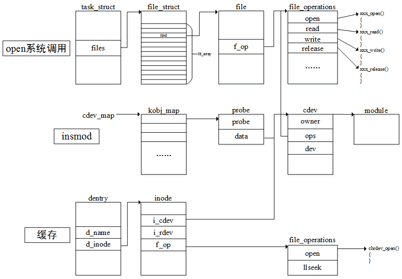

# About Char Device
###设备驱动分类

1. 字符设备驱动

   > 设备对数据的处理是按照字节流的形式进行的，可以支持随机访问(比如帧缓存设备)，也可以不支持随机访问(比如串口)，因为数据流量通常不是很大，所以一般没有页高速缓存。

2. 块设备驱动

   > 设备对数据的处理是按照若干个块进行的，一个块有其固定的大小，比如硬盘的一个扇区通常是512字节，那么每次读写的数据至少就是512字节。这类设备通常都支持随机访问，并且为了提高效率，可以将之前用到的数据缓存起来，以便下次使用。

3. 网络设备驱动

   > 它是专门针对网络设备的一类驱动，其主要作用是进行网络数据的收发。


### 字符设备驱动基础

1. mknod命令

   > 在现在的Linux系统中，设备文件是自动创建的，即便如此，我们还是可以通过mknod命令来手动创建一个设备文件。mknod命令将文件名、文件类型和主次设备号等信息保存在了磁盘上。

2. 如何打开一个文件

   

   > 在内核中，一个进程用一个task_struct结构对象来表示，其中的files成员指向了一个files_struct结构变量，该结构体中有一个fd_array的指针数组(用于维护打开文件的信息)，数组的每一个元素是指向file结构的一个指针。open系统调用函数在内核中对应的函数是sys_open，sys_open调用了do_sys_open，在do_sys_open中首先调用getname函数将文件名从用户空间复制到内核空间。接着调用get_unused_fd_flags来获取一个未使用的文件描述符，要获得该描述符，其实就是搜索files_struct中的fd_array数组，查看哪一个元素没有被使用，然后**返回其下标**即可。接下来调用do_filp_open函数来构造一个file结构，并初始化里面的成员。其中最重要的是将它的f_op成员指向和设备对应的驱动程序的操作方法集合的结构file_operations，这个结构中的绝大多数成员都是函数指针，通过file_operations中的open函数指针可以调用驱动中实现的特定于设备的打开函数，从而完成打开的操作。do_filp_open函数执行成功后，调用fd_install函数，该函数将刚才得到的文件描述符作为访问fd_array数组的下标，让下标对应的元素指向新构造的file结构。最后系统调用返回到应用层，将刚才的数组下标作为打开文件的文件描述符返回。 
   >
   > do_filp_open函数是这个过程中最复杂的一部分，简单来说，如果用户是第一次打开一个文件，那么会从磁盘中获取之前使用mknod保存的节点信息(文件类型，设备号等)，将其保存到内存中的inode结构体中。另外，通过判断文件的类型，还将inode中的f_op指针指向了def_chr_fops，这个结构体中的open函数指向了chrdev_open，其完成的主要工作是：首先根据设备号找到添加在内核中代表字符设备的cdev(cdev是放在cdev_map散列表中的，驱动加载时会构造相应的cdev并添加到这个散列表中，并且在构造这个cdev时还实现了一个操作方法集合，由cdev的ops成员指向它)，找到对应的cdev后，用cdev关联的操作方法集合替代之前构造的file结构体中的操作方法集合，然后调用cdev所关联的操作方法集合中的打开函数，完成设备真正的打开函数。
   >
   > 为了下一次能够快速打开文件，内核在第一次打开一个文件或目录时都会创建一个dentry的目录项，它保存了文件名和所对应的inode信息，所有的dentry使用散列的方式存储在目录项高速缓存中，内核在打开文件时会先在这个高速缓存中查找相应的dentry，如果找到，则可以立即获取文件所对应的inode，否则就会在磁盘上获取。
   >
   > 可以说，**字符设备驱动的框架就是围绕着设备号、cdev和操作方法集合来实现的。**

3. 查看内核中已经安装的设备驱动:`cat /proc/devices`


### 字符设备驱动框架

> 要实现一个字符设备驱动，最重要的事就是**要构造一个cdev结构对象，并让cdev同设备号和设备的操作方法集合相关联，然后将该cdev结构对象添加到内核的cdev_mao散列表中**

```c
#include <linux/init.h>
#include <linux/kernel.h>
#include <linux/module.h>
#include <linux/fs.h>
#include <linux/cdev.h>
#include <linux/kfifo.h>

#define VSER_MAJOR      256
#define VSER_MINOR      0
#define VSER_DEV_CNT    1
#define VSER_DEV_NAME   "vser"

static struct cdev vsdev;
DEFINE_KFIFO(vsfifo,char,32);/* 定义并初始化一个内核FIFO，元素个数必须是2的幂 */

static int vser_open(struct inode* inode,struct file* filp){
    return 0;
}

static int vser_release(struct inode* inode,struct file* filp){
    return 0;
}

static ssize_t vser_read(struct file* filp,char __user* buf,size_t count,loff_t* pos){
    unsigned int copied = 0;
    /* 将内核FIFO中的数据取出，复制到用户空间 */
    int ret = kfifo_to_user(&vsfifo,buf,count,&copied);
    if(ret){
        return ret;
    }
    return copied;
}

static ssize_t vser_write(struct file* filp,const char __user* buf,size_t count,loff_t* pos){
    unsigned int copied = 0;
    /* 将用户空间的数据放入内核FIFO中 */
    int ret = kfifo_from_user(&vsfifo,buf,count,&copied);
    if(ret){
        return ret;
    }
    return copied;
}

static struct file_operations vser_ops = {
    .owner = THIS_MODULE,
    .open = vser_open,
    .release = vser_release,
    .read = vser_read,
    .write = vser_write,
};

/* 模块初始化函数 */
static int __init vser_init(void){
    int ret;
    dev_t dev;

    dev = MKDEV(VSER_MAJOR,VSER_MINOR);
    /* 向内核注册设备号，静态方式 */
    ret = register_chrdev_region(dev,VSER_DEV_CNT,VSER_DEV_NAME);
    if(ret){
        goto reg_err;
    }
    /* 初始化cdev对象，绑定ops */
    cdev_init(&vsdev,&vser_ops);
    vsdev.owner = THIS_MODULE;
    /* 添加到内核中的cdev_map散列表中 */
    ret = cdev_add(&vsdev,dev,VSER_DEV_CNT);
    if(ret){
        goto add_err;
    }
    return 0;

add_err:
    unregister_chrdev_region(dev,VSER_DEV_CNT);
reg_err:
    return ret;
}

/* 模块清理函数 */
static void __exit vser_exit(void){
    dev_t dev;
    dev = MKDEV(VSER_MAJOR,VSER_MINOR);
    cdev_del(&vsdev);
    unregister_chrdev_region(dev,VSER_DEV_CNT);
}

/* 为模块初始化函数和清理函数取别名 */
module_init(vser_init);
module_exit(vser_exit);

MODULE_LICENSE("GPL");
MODULE_AUTHOR("suda-morris <362953310@qq.com>");
MODULE_DESCRIPTION("A simple module");
MODULE_ALIAS("virtual-serial");
```

* **THIS_MODULE**是包含驱动的模块中的struct module类型对象的地址，类似于C++中的this指针，这样就能通过cdev或者fops找到对应的模块，在对前面两个对象访问时都要调用类似于try_module_get的函数增加模块的引用计数，因为在这两个对象使用的过程中，模块是不能被卸载的，模块被卸载的前提条件是引用计数为0


### 一个驱动支持多个设备

> 1. 首先要向内核注册多个设备号
> 2. 其次就是在添加cdev对象的时候指明该cdev对象管理了多个设备，或者添加多个cdev对象，每个cdev对象管理一个设备
> 3. 最麻烦的在于读写操作的时候区分对哪个设备进行操作。open接口中的inode形参中包含了对应设备的设备号以及所对应的cdev对象的地址。因此可以在open接口函数中读取这些信息，并存放在file结构体对象的某个成员中，再在读写的接口函数中获取该file结构的成员，从而可以区分出对哪个设备进行操作

#### 使用一个cdev实现对多个设备的支持

```c
#include <linux/init.h>
#include <linux/kernel.h>
#include <linux/module.h>
#include <linux/fs.h>
#include <linux/cdev.h>
#include <linux/kfifo.h>

#define VSER_MAJOR      256
#define VSER_MINOR      0
#define VSER_DEV_CNT    2   //本驱动支持两个设备
#define VSER_DEV_NAME   "vser"

static struct cdev vsdev;
DEFINE_KFIFO(vsfifo0,char,32);
DEFINE_KFIFO(vsfifo1,char,32);

static int vser_open(struct inode* inode,struct file* filp){
    /* 根据次设备号来区分具体的设备 */
    switch(MINOR(inode->i_rdev)){
        default:
        case 0:
            filp->private_data = &vsfifo0;
            break;
        case 1:
            filp->private_data = &vsfifo1;
            break;
    }
    return 0;
}

static int vser_release(struct inode* inode,struct file* filp){
    return 0;
}

static ssize_t vser_read(struct file* filp,char __user* buf,size_t count,loff_t* pos){
    unsigned int copied = 0;
    /* 将内核FIFO中的数据取出，复制到用户空间 */
    struct kfifo* vsfifo = filp->private_data;
    int ret = kfifo_to_user(vsfifo,buf,count,&copied);
    if(ret){
        return ret;
    }
    return copied;
}

static ssize_t vser_write(struct file* filp,const char __user* buf,size_t count,loff_t* pos){
    unsigned int copied = 0;
    /* 将用户空间的数据放入内核FIFO中 */
    struct kfifo* vsfifo = filp->private_data;
    int ret = kfifo_from_user(vsfifo,buf,count,&copied);
    if(ret){
        return ret;
    }
    return copied;
}

static struct file_operations vser_ops = {
    .owner = THIS_MODULE,
    .open = vser_open,
    .release = vser_release,
    .read = vser_read,
    .write = vser_write,
};

/* 模块初始化函数 */
static int __init vser_init(void){
    int ret;
    dev_t dev;

    dev = MKDEV(VSER_MAJOR,VSER_MINOR);
    /* 向内核注册设备号，静态方式 */
    ret = register_chrdev_region(dev,VSER_DEV_CNT,VSER_DEV_NAME);
    if(ret){
        goto reg_err;
    }
    /* 初始化cdev对象，绑定ops */
    cdev_init(&vsdev,&vser_ops);
    vsdev.owner = THIS_MODULE;
    /* 添加到内核中的cdev_map散列表中 */
    ret = cdev_add(&vsdev,dev,VSER_DEV_CNT);
    if(ret){
        goto add_err;
    }
    return 0;

add_err:
    unregister_chrdev_region(dev,VSER_DEV_CNT);
reg_err:
    return ret;
}

/* 模块清理函数 */
static void __exit vser_exit(void){
    dev_t dev;
    dev = MKDEV(VSER_MAJOR,VSER_MINOR);
    cdev_del(&vsdev);
    unregister_chrdev_region(dev,VSER_DEV_CNT);
}

/* 为模块初始化函数和清理函数取别名 */
module_init(vser_init);
module_exit(vser_exit);

MODULE_LICENSE("GPL");
MODULE_AUTHOR("suda-morris <362953310@qq.com>");
MODULE_DESCRIPTION("A simple module");
MODULE_ALIAS("virtual-serial");
```

#### 将每一个cdev对象对应到一个设备

```c
#include <linux/init.h>
#include <linux/kernel.h>
#include <linux/module.h>
#include <linux/fs.h>
#include <linux/cdev.h>
#include <linux/kfifo.h>

#define VSER_MAJOR 256
#define VSER_MINOR 0
#define VSER_DEV_CNT 2 //本驱动支持两个设备
#define VSER_DEV_NAME "vser"

static DEFINE_KFIFO(vsfifo0, char, 32);
static DEFINE_KFIFO(vsfifo1, char, 32);

struct vser_dev
{
    struct cdev cdev;
    struct kfifo *fifo;
};

static struct vser_dev vsdev[2];

static int vser_open(struct inode *inode, struct file *filp)
{
    struct vser_dev *vsdev = container_of(inode->i_cdev, struct vser_dev, cdev);
    filp->private_data = vsdev->fifo;
    return 0;
}

static int vser_release(struct inode *inode, struct file *filp)
{
    return 0;
}

static ssize_t vser_read(struct file *filp, char __user *buf, size_t count, loff_t *pos)
{
    unsigned int copied = 0;
    /* 将内核FIFO中的数据取出，复制到用户空间 */
    struct kfifo *vsfifo = filp->private_data;
    int ret = kfifo_to_user(vsfifo, buf, count, &copied);
    if (ret)
    {
        return ret;
    }
    return copied;
}

static ssize_t vser_write(struct file *filp, const char __user *buf, size_t count, loff_t *pos)
{
    unsigned int copied = 0;
    /* 将用户空间的数据放入内核FIFO中 */
    struct kfifo *vsfifo = filp->private_data;
    int ret = kfifo_from_user(vsfifo, buf, count, &copied);
    if (ret)
    {
        return ret;
    }
    return copied;
}

static struct file_operations vser_ops = {
    .owner = THIS_MODULE,
    .open = vser_open,
    .release = vser_release,
    .read = vser_read,
    .write = vser_write,
};

/* 模块初始化函数 */
static int __init vser_init(void)
{
    int ret;
    dev_t dev;
    int i;

    dev = MKDEV(VSER_MAJOR, VSER_MINOR);
    /* 向内核注册设备号，静态方式 */
    ret = register_chrdev_region(dev, VSER_DEV_CNT, VSER_DEV_NAME);
    if (ret)
    {
        goto reg_err;
    }
    /* 初始化cdev对象，绑定ops */
    for (i = 0; i < VSER_DEV_CNT; i++)
    {
        cdev_init(&vsdev[i].cdev, &vser_ops);
        vsdev[i].cdev.owner = THIS_MODULE;
        vsdev[i].fifo = i == 0 ? (struct kfifo *)&vsfifo0 : (struct kfifo *)&vsfifo1;
        /* 添加到内核中的cdev_map散列表中 */
        ret = cdev_add(&vsdev[i].cdev, dev + i, 1);
        if (ret)
        {
            goto add_err;
        }
    }
    return 0;

add_err:
    for (--i; i > 0; --i)
    {
        cdev_del(&vsdev[i].cdev);
    }
    unregister_chrdev_region(dev, VSER_DEV_CNT);
reg_err:
    return ret;
}

/* 模块清理函数 */
static void __exit vser_exit(void)
{
    dev_t dev;
    int i;

    dev = MKDEV(VSER_MAJOR, VSER_MINOR);
    for (i = 0; i < VSER_DEV_CNT; i++)
    {
        cdev_del(&vsdev[i].cdev);
    }
    unregister_chrdev_region(dev, VSER_DEV_CNT);
}

/* 为模块初始化函数和清理函数取别名 */
module_init(vser_init);
module_exit(vser_exit);

MODULE_LICENSE("GPL");
MODULE_AUTHOR("suda-morris <362953310@qq.com>");
MODULE_DESCRIPTION("A simple module");
MODULE_ALIAS("virtual-serial");
```

