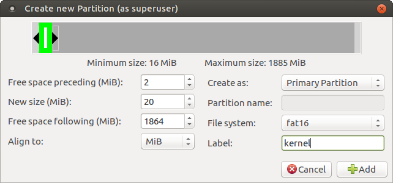
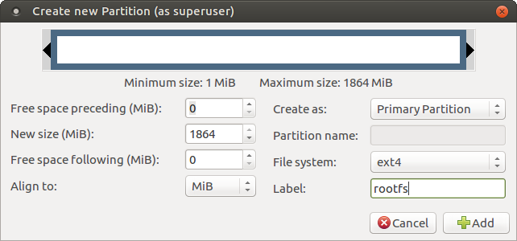

# SUDA-V3S User Guide

### 简介

1. 主控芯片
   * 全志V3S处理器，单核Cortex-A7，工作主频24M~1.2GHz，内置64MB DDR2
   * 支持从SD卡启动，支持从SPI Flash启动(8~32MB Nor Flash或者128MB Nand Flash)
   * 支持RGB LCD，分辨率可以为272x480，480x800，1024x600
2. 功耗
   * 1GHz，Linux空闲状态，90~100mA
   * 1GHz，Linux全速运行，180mA

### 系统引导流程

```flow
st=>start: 上电
check_bsp=>condition: BSP引脚是否为低电平
sdc0_boot_op=>operation: SDC0引导过程
check_sdc0_boot=>condition: SDC0引导成功
spi0nor_boot_op=>operation: SPI0 Nor引导过程
check_spi0nor_boot=>condition: SPI0 Nor引导成功
spi0nand_boot_op=>operation: SPI0 Nand引导过程
check_spi0nand_boot=>condition: SPI0 Nand引导成功
e_boot_ok=>end: 引导成功，执行其余固件
e_go_usb_boot=>end: USB引导过程

st->check_bsp
check_bsp(yes,right)->e_go_usb_boot
check_bsp(no)->sdc0_boot_op->check_sdc0_boot
check_sdc0_boot(yes,right)->e_boot_ok
check_sdc0_boot(no)->spi0nor_boot_op->check_spi0nor_boot
check_spi0nor_boot(yes,right)->e_boot_ok
check_spi0nor_boot(no)->spi0nand_boot_op->check_spi0nand_boot
check_spi0nand_boot(yes,right)->e_boot_ok
check_spi0nand_boot(no)->e_go_usb_boot
```


### 安装交叉编译器arm-linux-gnueabihf

[下载地址](https://releases.linaro.org/components/toolchain/binaries/latest/arm-linux-gnueabihf/)

```shell
wget https://releases.linaro.org/components/toolchain/binaries/latest/arm-linux-gnueabihf/gcc-linaro-7.2.1-2017.11-x86_64_arm-linux-gnueabihf.tar.xz
tar xvf gcc-linaro-6.3.1-2017.05-x86_64_arm-linux-gnueabihf.tar.xz
mv gcc-linaro-6.3.1-2017.05-x86_64_arm-linux-gnueabihf /opt/
vim /etc/bash.bashrc
# add: PATH="$PATH:/opt/gcc-linaro-7.2.1-2017.11-x86_64_arm-linux-gnueabihf/bin"
arm-linux-gnueabihf-gcc -v
sudo apt-get install device-tree-compiler
```

### 下载&编译u-boot

```shell
git clone https://github.com/Lichee-Pi/u-boot.git -b v3s-current
#or git clone https://github.com/Lichee-Pi/u-boot.git -b v3s-spi-experimental
cd u-boot
make ARCH=arm CROSS_COMPILE=arm-linux-gnueabihf- LicheePi_Zero_800x480LCD_defconfig
#or make ARCH=arm CROSS_COMPILE=arm-linux-gnueabihf- LicheePi_Zero_480x272LCD_defconfig
#or make ARCH=arm CROSS_COMPILE=arm-linux-gnueabihf- LicheePi_Zero_defconfig
make ARCH=arm menuconfig
time make ARCH=arm CROSS_COMPILE=arm-linux-gnueabihf- 2>&1 | tee build.log
```

最终在当前目录中会增加两个文件：u-boot-sunxi-with-spl.bin和build.log

### 下载&编译Linux内核

```shell
git clone https://github.com/Lichee-Pi/linux.git
cd linux
make ARCH=arm licheepi_zero_defconfig
make ARCH=arm menuconfig   #add bluethooth, etc.
make ARCH=arm CROSS_COMPILE=arm-linux-gnueabihf- -j16
make ARCH=arm CROSS_COMPILE=arm-linux-gnueabihf- -j16 INSTALL_MOD_PATH=out modules
make ARCH=arm CROSS_COMPILE=arm-linux-gnueabihf- -j16 INSTALL_MOD_PATH=out modules_install
```

最终会在arch/arm/boot下生成zImage，在out文件夹下生成驱动.ko文件

### 系统烧写

 #### SD卡分区

> SD卡中的系统镜像一般分为三个区，第一个区称为boot区或者引导区，该部分没有文件系统而是直接将二进制的bootloader(uboot)文件直接写入。第二个区可以被称为linux内核区，fat文件系统，存放linux内核、内核参数文件还有设备数dtb文件。第三个区是root分区，用来存放根文件系统和用户数据等，一般是ext4文件分区格式。
>
> SD卡区域划分：
>
> | 0~2MB  | +20M   | Rest   |
> | ------ | ------ | ------ |
> | u-boot | kernel | rootfs |

1. 准备一张空白的SD卡，打开GParted系统工具


2. 新建一个20MB大小的分区，并选择文件系统的格式fat16



3. 讲SD卡剩余空间新建为一个新的分区，并选择文件系统的格式为ext4



4. 最终SD的分区结果如下图所示，单击:heavy_check_mark:开始执行分区操作


5. 打开终端，输入命令`sudo fdisk -l /dev/sdc`查看分区信息，其中sdc1代表sdc设备的第一个分区，sdc2代表第二个分区


#### u-boot烧写

> u-boot需要烧写到SD卡的8K偏移处
>
> `sudo dd if=u-boot-sunxi-with-spl.bin of=/dev/sdc bs=1024 seek=8`


Linux主机安装minicom，使用命令：`sudo apt-get install minicom`

串口终端tty属于**dialout**组别，需要将当前用户添加到该组中，这样才有权限访问tty*设备，具体使用如下命令:`sudo usermod -a -G dialout your-user-name`


