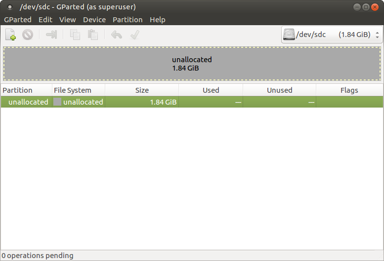
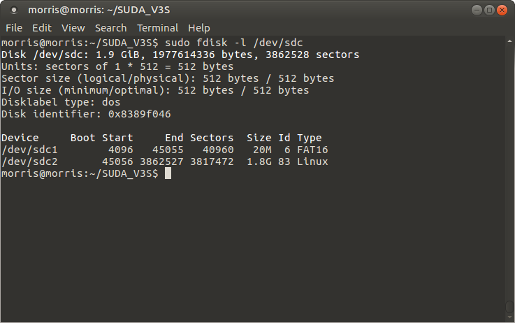
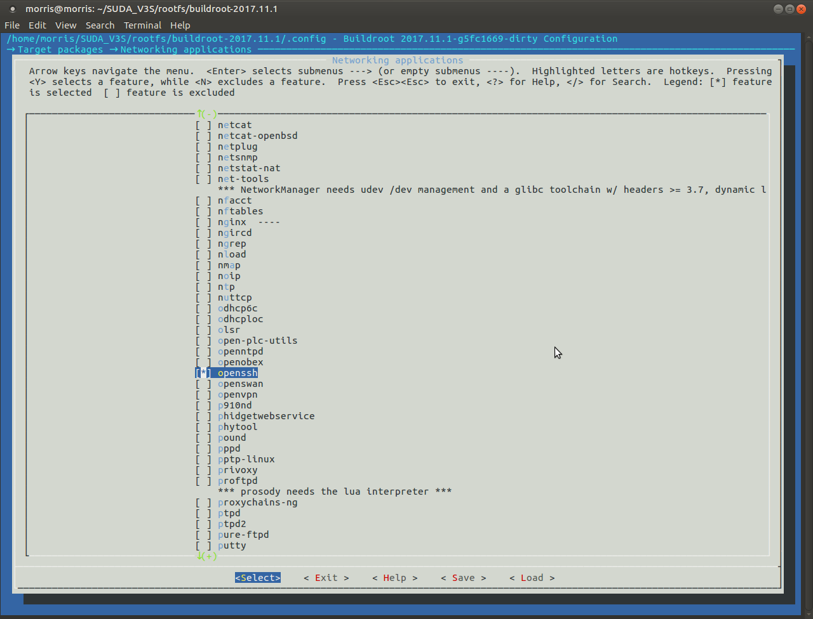
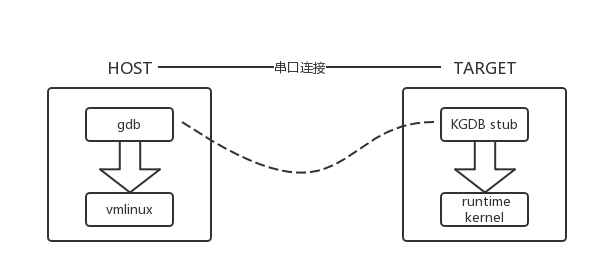
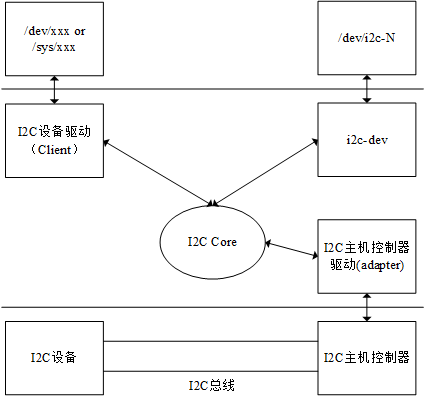

#  SUDA-V3S User Guide

### 简介

1. 主控芯片
   * 全志V3S处理器，单核Cortex-A7，工作主频24M~1.2GHz，内置64MB DDR2
   * 支持从SD卡启动，支持从SPI Flash启动(8~32MB Nor Flash或者128MB Nand Flash)
   * 支持RGB LCD，分辨率可以为272x480，480x800，1024x600
   * 40nm工艺
2. 功耗
   * 1GHz，Linux空闲状态，90~100mA
   * 1GHz，Linux全速运行，180mA

### sunxi

> * 全志(Allwinner)公司的很多SoC产品代号都是sunxi，比如A10(sun4i)，A13(sun5i)，A20(sun7i)，[详细信息可以查看全志SoC家族产品](https://sunxi.org/Allwinner_SoC_Family)，我们将要使用的V3s属于sun8i.
> * sunxi也是一个专门负责推广和支持全志SoC平台开源硬件的社区，但是全志本身并没有加入这个社区.

### 上电引导流程


* 其中的BSP(boot select pin)引脚为PC0，短接PC0和GND后上电即可进入USB引导模式(可以通过sunxi-tool工具来烧写程序到SPI Flash中)


### zImage生成过程


> 按照特定的顺序编译链接目标代码，在内核源码顶层目录生成vmlinux(因为Linux内核运行在虚拟地址空间，所以名字附加vm)。讲vmlinux内核主体通过objcopy工具将ELF格式文件转换成二进制格式的文件Image(去掉了符号、标记和注释等)。通过gzip工具讲Image进行压缩，生成piggy.gz的压缩文件，该压缩文件作为一段汇编代码中的一段数据，再讲该汇编代码编译后生成一个piggy.o目标文件。将这个目标文件同其他文件的一些目标文件(主要包括加压缩和设备树操作的相关代码)一起进行链接又形成一个vmlinux文件，最后通过objcopy把刚才生成的ELF格式的vmlinux文件转换成zImage二进制格式的文件。


### Linux系统启动流程


> 内核的zImage镜像开始执行时，首先解压缩后面所跟的piggy.gz到指定的位置。但解压后的内容可能会覆盖当前正在运行的代码或数据，于是解压代码先判断是否会发生覆盖，如果是，则先要将自己重定位到另外一个位置，然后再进行解压。加压完成后跳转到解压后的起始地址执行代码，即Linux内核的而主体代码开始运行。Linux内核的主体代码将会执行一系列复杂的初始化过程，然后去挂载根文件系统，最后执行用户空间的第一个初始化程序，从而完成整个内核的启动过程。
>
> zImage的第一条指令所在的文件是自引导程序中的head.S，位于arch/arm/boot/compressed/head.S。解压内核调用的函数decompress_kernel使用C语言编写，位于arch/arm/boot/compressed/misc.c。在解压完内核主体后，关闭MMU和cache，保存machine ID的值到寄存器r1中，保存atags的地址或者dtb的地址到寄存器r2中，然后调用_enter_kernel进入到内核主体代码中执行。
>
>  _enter_kernel位于arch/arm/kernel/head.S，会判断是否支持该处理器，判断r2中的内容是atags还是dtb，判断处理器是否是对称多处理器(SMP)，创建临时页表(存放在物理内存前16KB)，使能MMU，调用\_mmap_switched函数。
>
> _mmap_switchde函数位于arch/arm/kernel/head-common.S，主要工作是复制数据段，清除BSS段，保存处理器ID，机器ID，atags或dtb地址和控制寄存器的值后，调用了内核的公共入口函数**start_kernel**，从而开启了内核的初始化过程。
>
> start_kernel函数负责初始化内核各子系统，其中调用了一个很重要的函数setup_arch，该函数位于arch/arm/kernel/setup.c，主要是针对体系结构的相关信息进行设置包括调用unflatten_device_tree函数，将设备树转化成设备节点。
>
> start_kernel函数的最后调用了rest_init函数，创建并调度了一个叫做**kernel_init**的内核线程，其pid为1，创建另一个线程**kthreadd**，其pid为2，作用是管理和调度其他内核线程。需要注意的是，kernel_init线程需要等待kthreadd的创建完成后才能被调度，否则会产生OOPs。
>
> kernel_init线程负责完成初始化设备驱动、挂载根文件系统和启动用户空间的init进程等重要工作，用户空间的init进程可以通过comand_line传递给内核，比如`init=/linuxrc`，如果没有指定，则会依次执行`/sbin/init`,`/etc/init`,`/bin/init`,`/bin/sh`，直到成功为止。
>
> 在kernel_init线程中，调用了kernel_init_freeable函数，而kernel_init_freeable函数调用了do_basic_setup函数，在这个函数中调用了一些初始化函数，其中的driver_init就是在这里调用的。driver_init函数创建Linux驱动模型中的kobject、kset等，并注册到sysfs文件系统中，然后在这基础上注册平台总线和一些关键的子系统，从而初始化了Linux驱动模型。此外do_basic_setup函数又调用了do_initcalls函数，该函数会按照预定的顺序依次调用链接在一个特殊段中的初始化函数，这其中包含了驱动程序的模块初始化函数的调用，这样就初始化了各个驱动。
>
> 根文件系统的挂载大致分两步
>
> 1. 创建并挂载一个虚拟的根文件系统，通过start_kernel函数调用vfs_caches_init函数来完成
> 2. 挂载一个真实的根文件系统，kernel_init调用了kernel_init_freeable函数，kernel_init_freeable调用了do_basic_setup函数，而do_basic_setup函数又调用了do_initcalls函数，如果内核配置了"Initial RAM filesystem and RAM disk(initramfs/initrd) support"选项，那么在do_initcalls函数中会调用populate_rootfs函数，该函数负责initramfs或者initrd的处理。要么把initramfs解压到rootfs(第一步挂载的根文件系统)中，要么把cpio格式的initrd解压到rootfs中，要么把image格式的initrd保存到/initrd.image中，要么出错。如果是后两种情况，在do_basic_setup函数之后，会调用prepare_namespace函数，尝试从其他设备上挂载文件系统。从其他设备成功挂载好根文件系统后，接着首先挂载一个devtmpfs的文件系统，然后将第二步挂载的文件系统改为根文件系统，这样根文件系统就挂载好了。


### 安装交叉编译器arm-linux-gnueabihf

[下载地址](https://releases.linaro.org/components/toolchain/binaries/latest/arm-linux-gnueabihf/)

```shell
wget https://releases.linaro.org/components/toolchain/binaries/6.4-2017.11/arm-linux-gnueabihf/gcc-linaro-6.4.1-2017.11-x86_64_arm-linux-gnueabihf.tar.xz
tar xvf gcc-linaro-6.4.1-2017.11-x86_64_arm-linux-gnueabihf.tar.xz
mv gcc-linaro-6.4.1-2017.11-x86_64_arm-linux-gnueabihf /opt/
vim /etc/bash.bashrc
# add: PATH="$PATH:/opt/gcc-linaro-6.4.1-2017.11-x86_64_arm-linux-gnueabihf/bin"
arm-linux-gnueabihf-gcc -v
sudo apt-get install device-tree-compiler
```

### 下载&编译u-boot

```shell
git clone https://github.com/Lichee-Pi/u-boot.git -b v3s-current
#or git clone https://github.com/Lichee-Pi/u-boot.git -b v3s-spi-experimental
cd u-boot
make ARCH=arm CROSS_COMPILE=arm-linux-gnueabihf- LicheePi_Zero_800x480LCD_defconfig
#or make ARCH=arm CROSS_COMPILE=arm-linux-gnueabihf- LicheePi_Zero_480x272LCD_defconfig
#or make ARCH=arm CROSS_COMPILE=arm-linux-gnueabihf- LicheePi_Zero_defconfig
make ARCH=arm menuconfig
time make ARCH=arm CROSS_COMPILE=arm-linux-gnueabihf- 2>&1 | tee build.log
```

* 最终在当前目录中会增加两个文件：u-boot-sunxi-with-spl.bin和build.log

#### u-boot中的目录结果

```bash
├── api                存放uboot提供的API接口函数
├── arch               平台相关的部分我们只需要关心这个目录下的ARM文件夹
│   ├──arm
│   │   └──cpu
│   │   │   └──armv7
│   │   └──dts	
│   │   │   └──*.dts   存放设备的dts,也就是设备配置相关的引脚信息
├── board              对于不同的平台的开发板对应的代码
├── cmd                顾名思义，大部分的命令的实现都在这个文件夹下面。
├── common             公共的代码
├── configs            各个板子的对应的配置文件都在里面，我们的Lichee配置也在里面
├── disk               对磁盘的一些操作都在这个文件夹里面，例如分区等。
├── doc                参考文档，这里面有很多跟平台等相关的使用文档。
├── drivers            各式各样的驱动文件都在这里面
├── dts                一种树形结构（device tree）这个应该是uboot新的语法
├── examples           官方给出的一些样例程序
├── fs                 文件系统，uboot会用到的一些文件系统
├── include            头文件，所有的头文件都在这个文件夹下面
├── lib                一些常用的库文件在这个文件夹下面  
├── Licenses           这个其实跟编译无关了，就是一些license的声明
├── net                网络相关的，需要用的小型网络协议栈
├── post               上电自检程序
├── scripts            编译脚本和Makefile文件
├── spl                second program loader，即相当于二级uboot启动。
├── test               小型的单元测试程序。
└── tools              里面有很多uboot常用的工具
```

###编译boot.scr

#### 编写boot.cmd文件(启动参数文件)

```shell
setenv bootargs console=ttyS0,115200 panic=5 console=tty0 rootwait root=/dev/mmcblk0p2 earlyprintk rw
load mmc 0:1 0x41000000 zImage
load mmc 0:1 0x41800000 sun8i-v3s-licheepi-zero-dock.dtb
bootz 0x41000000 - 0x41800000
```

####编译成二进制文件

```ba
mkimage -C none -A arm -T script -d boot.cmd boot.scr
```

### 下载&编译Linux内核

```shell
git clone https://github.com/Lichee-Pi/linux.git
cd linux
make ARCH=arm licheepi_zero_defconfig
make ARCH=arm menuconfig   #add bluethooth, etc.
make ARCH=arm CROSS_COMPILE=arm-linux-gnueabihf- -j16
make ARCH=arm CROSS_COMPILE=arm-linux-gnueabihf- -j16 INSTALL_MOD_PATH=out modules
make ARCH=arm CROSS_COMPILE=arm-linux-gnueabihf- -j16 INSTALL_MOD_PATH=out modules_install
```

最终会在arch/arm/boot下生成zImage，在arch/arm/boot/dts/下生成设备树二进制文件，在out文件夹下生成驱动.ko文件


### 系统烧写

 #### SD卡分区

> SD卡中的系统镜像一般分为三个区，第一个区称为boot区或者引导区，该部分没有文件系统而是直接将二进制的bootloader(uboot)文件直接写入。第二个区可以被称为linux内核区，fat文件系统，存放linux内核、内核参数文件还有设备数dtb文件。第三个区是root分区，用来存放根文件系统和用户数据等，一般是ext4文件分区格式。
>
> SD卡区域划分：
>
> | 0~2MB  | +20M   | Rest   |
> | ------ | ------ | ------ |
> | u-boot | kernel | rootfs |

1. 准备一张空白的SD卡，打开GParted系统工具



2. 新建一个20MB大小的分区，并选择文件系统的格式fat16


3. 讲SD卡剩余空间新建为一个新的分区，并选择文件系统的格式为ext4


4. 最终SD的分区结果如下图所示，单击:heavy_check_mark:开始执行分区操作


5. 打开终端，输入命令`sudo fdisk -l /dev/sdc`查看分区信息，其中sdc1代表sdc设备的第一个分区，sdc2代表第二个分区



#### 烧写u-boot

> u-boot需要烧写到SD卡的8K偏移处
>
> `sudo dd if=u-boot-sunxi-with-spl.bin of=/dev/sdc bs=1024 seek=8`


Linux主机安装minicom，使用命令：`sudo apt-get install minicom`

串口终端tty属于**dialout**组别，需要将当前用户添加到该组中，这样才有权限访问tty*设备，具体使用如下命令:`sudo usermod -a -G dialout your-user-name`

#### 烧写内核启动参数,zImage和设备树

1. 编写boot.cmd文件，并且编译成boot.scr二进制
2. 将boot.scr，zImage，dtb设备文件拷贝到SD卡的第一个分区


### 根文件系统之buildroot

> 文件系统是操作系统用于明确磁盘或分区上文件的组织和访问的方法。文件系统的存在，使得数据可以被有效而透明地存取访问。
>
> 根文件系统是内核启动时直接挂载在根目录下的一个文件系统，它包含了Linux系统运行所必须的一些工具、库、脚本、配置文件和设备文件等。
>
> buildroot可用于构建小型的linux根文件系统，大小最小可低至2M
>
> buildroot中可以方便地加入第三方软件包，省去了手工交叉编译的烦恼
>
> 美中不足的是不支持包管理系统

```bash
git clone https://git.busybox.net/buildroot
cd buildroot
make menuconfig
make
```

编译结束后，会在output/images下生成归档文件``rootfs.tar``，使用超级权限将其解压至SD卡的第二分区中

`sudo tar -vxf rootfs.tar -C /media/morris/rootfs/`

* 如果需要在buildroot的基础上做进一步的修改，直接进入``output/target/``目录下，在这里修改一些文件，然后重新在根目录下执行``make``，会将跟新的文件内容重新打包到新的rootfs.tar中

  * 注意output/target目录不是最终的根文件系统，是临时的，不能直接拿来烧录

* 举个例子：修改环境变量**PS1**(默认提示符)

  ```bash
  cd output/target
  vim etc/profile
  #增加export PS1='\[\e[32m\][\[\e[35m\]\u\[\e[m\]@\[\e[36m\]\h \[\e[31m\]\w\[\e[32m\]]\[\e[36m\]$\[\e[m\]'
  cd ../../
  make
  ```

* buildroot的一些重要配置

  1. 配置工具链，使用本地已经安装好的交叉编译工具链，在本机上外部工具链配置为：/home/morris/SUDA_V3S/toolchains/gcc-linaro-6.4.1-2017.11-x86_64_arm-linux-gnueabihf
  2. 工具链前缀是：arm-linux-gnueabihf
  3. 外部工具链gcc版本：这里使用的是6.4版本
  4. 外部工具链内核头文件：是在arm-linux-gnueabi/libc/usr/include/linux/version.h里读取内核版本信息。这里的版本是4.6
  5. C库还是选择传统的glibc。需要小体积可以选uclibc（需要自行编译安装）
  6. 在system 设置下主机名，root密码等


#### 添加openssh服务



* 默认情况下，openssh服务器是不允许客户以root身份登录的，需要修改output/target/etc/ssh/sshd_config文件，打开`PermitRootLogin yes`选项

#### 【解决】buildroot修改配置后编译得到的文件大小没变化

* 删除生成的二进制文件，再删除 .stamp_built文件
* 重新make


### 安装内核模块

```bash
mount ${cardroot} /mnt
mkdir -p /mnt/lib/modules
rm -rf /mnt/lib/modules/
cp -r <PATH_TO_KERNEL_TREE>/output/lib /mnt/
umount /mnt
```


### Debian系统之debootstrap

> Debootstrap可以用来在系统中安装Debian而不使用安装盘，也可以用来在chroot环境下运行不同风格的Debian。这样可以创建一个完整的（最小的）Debian系统，可以用于测试目的。制作流程分为四个步骤：
>
> 1. 从源里下载需要的.deb软件包
> 2. 解压它们到相应的目标目录
> 3. 用chroot命令将目标目录临时修改为根目录
> 4. 运行每个软件包的安装和配置脚本，完成安装
>
> 完成第1和2步可以使用debootstrap，cdebootstrap或者multistrap，第3和4步可以在QEMU环境或者实际开发板上执行

1. 安装必要的工具软件`sudo apt-get install qemu qemu-user-static binfmt-support dpkg-cross debootstrap debian-archive-keyring`其中debootstrap是根文件系统制作工具，qemu是模拟器，可以在宿主机上模拟开发版的环境
2. 使用debootstrap安装指定版本的文件系统，其中distro表示版本的名字，比如ubuntu的**xenial**，debian的**stretch**，armhf是目标架构，最后加上Debian镜像站点，这里选择清华大学的开源镜像站，后面的.deb包将从这里下载

```bash
sudo debootstrap --foreign --arch armhf $distro rootfs http://ftp2.cn.debian.org/debian/
```

3. 拷贝**qemu-arm-static** 到刚构建的根文件系统中。为了能chroot到目标文件系统，针对目标CPU的qemu模拟器需要从内部访问

```bash
sudo cp /usr/bin/qemu-arm-static rootfs/usr/bin/
sudo LC_ALL=C LANGUAGE=C LANG=C chroot rootfs	#改变程序执行时所参考的根目录位置
```

4. 执行debootstrap的第二个步骤来解压安装的软件包

```bash
/debootstrap/debootstrap --second-stage
dpkg --configure -a
```

5. 配置软件源

```bash
# for Debian
cat <<EOT > etc/apt/sources.list
deb http://http.debian.net/debian $distro main contrib non-free
deb-src http://http.debian.net/debian $distro main contrib non-free
deb http://http.debian.net/debian $distro-updates main contrib non-free
deb-src http://http.debian.net/debian $distro-updates main contrib non-free
deb http://security.debian.org/debian-security $distro/updates main contrib non-free
deb-src http://security.debian.org/debian-security $distro/updates main contrib non-free
EOT
```

```bash
# for Ubuntu
cat <<EOT > etc/apt/sources.list
deb http://ports.ubuntu.com/ $distro main universe
deb-src http://ports.ubuntu.com/ $distro main universe
deb http://ports.ubuntu.com/ $distro-security main universe
deb-src http://ports.ubuntu.com/ $distro-security main universe
deb http://ports.ubuntu.com/ $distro-updates main universe
deb-src http://ports.ubuntu.com/ $distro-updates main universe
EOT#
```

6. 设置apt

```bash
cat <<EOT > /etc/apt/apt.conf.d/71-no-recommends
APT::Install-Recommends "0";
APT::Install-Suggests "0";
EOT
```

7. 从服务器更新最新的数据库`apt-get update`
8. 更新系统`apt-get upgrade`
9. 按需安装软件包

```bash
apt-get install openssh-server
apt-get install dialog locales
dpkg-reconfigure locales
dpkg-reconfigure tzdata
```

10. 设置root密码`passwd`
11. 设置主机名`echo suda-v3s > /etc/hostname`
12. 清理无用的软件包，退出chroot会话

```bash
apt-get autoclean
apt-get autoremove
apt-get clean
exit
```

13. 清理辅助文件

```bash
sudo rm rootfs/usr/bin/qemu-arm-static 
```

14. 安装驱动模块

```bash
mount ${card}${p}2 /mnt
mkdir -p /mnt/lib/modules
rm -rf /mnt/lib/modules/
cp -r ${lib_dir}/lib /mnt/
umount /mnt
```


### Debian系统之multistrap

> Multistrap是一种与Debootstrap基本相同的工具，但具有不同的设计，拥有更多的灵活性。它通过简单地使用apt和dpkg，专注于为设备生成rootfs映像，而不是在现有的机器上chroots。Multistrap是一个自动创建完整的，可引导的根文件系统的工具。它可以合并来自不同存储库的软件包来创建rootfs。额外的软件包通过简单的列出来添加到rootfs中，所有的依赖关系都被处理了。

1. 安装依赖包

```bash
sudo apt-get install multistrap qemu qemu-user-static binfmt-support dpkg-cross
```

2. 编辑arm32.conf配置文件来指明需要安装的软件包和软件源，这里使用了中科大的镜像站

```makefile
[General]
cleanup=true
noauth=true
unpack=true
debootstrap=Debian Net Utils Python Init
aptsources=Debian

[Debian]
packages=apt kmod lsof apt-utils
source=https://mirrors.ustc.edu.cn/debian/
keyring=debian-archive-keyring
suite=stretch
components=main contrib non-free

[Net]
#Basic packages to enable the networking
packages=netbase net-tools ethtool udev iproute iputils-ping ifupdown isc-dhcp-client ssh ca-certificates apt-transport-https
source=https://mirrors.ustc.edu.cn/debian/

[Utils]
#General purpose utilities
packages=locales adduser vim less wget dialog usbutils rsync git sqlite3 libsqlite3-dev dphys-swapfile i2c-tools
source=https://mirrors.ustc.edu.cn/debian/

[Python]
#Python Language
packages=python python-pip
source=https://mirrors.ustc.edu.cn/debian/

[Init]
#Init system,select init or systemd
packages=init systemd
source=https://mirrors.ustc.edu.cn/debian/
```

3. 要创建根文件系统中/dev/中的设备，我们将使用multistrap提供的device-table.pl脚本。在此之前，需要创建dev_table文件，在其中指定设备列表

```bash
#<name>         <type>  <mode>  <uid>   <gid>   <major> <minor> <start> <inc> <count>
/dev    		d       755     0       0       -       -       -       -       -
/dev/mem        c       640     0       0       1       1       0       0      -
/dev/kmem       c       640     0       0       1       2       0       0      -
/dev/null       c       640     0       0       1       3       0       0      -
/dev/zero       c       640     0       0       1       5       0       0      -
/dev/random     c       640     0       0       1       8       0       0      -
/dev/urandom    c       640     0       0       1       9       0       0      -
/dev/tty        c       666     0       0       5       0       0       0      -
/dev/tty        c       666     0       0       4       0       0       1      6
/dev/console    c       640     0       0       5       1       0       0      -
/dev/ram        b       640     0       0       1       1       0       0      -
/dev/ram        b       640     0       0       1       0       0       1      4
/dev/loop       b       640     0       0       7       0       0       1      2
/dev/ptmx       c       666     0       0       5       2       0       0      -
```

4. 在根文件系统的dev中创建必要的设备

```bash
sudo /usr/share/multistrap/device-table.pl --no-fakeroot -d rootfs -f dev_table
```

5. 创建根文件系统

```bash
sudo multistrap -d rootfs -a armhf -f arm32.conf
```

* 执行完成后，rootfs即是所需的根文件系统

6. 使用qemu来配置软件包，将rootfs作为root挂载来操作

```bash
sudo cp /usr/bin/qemu-arm-static rootfs/usr/bin
sudo mount -o bind /dev/ rootfs/dev/
export DEBIAN_FRONTEND=noninteractive DEBCONF_NONINTERACTIVE_SEEN=true
export LC_ALL=C LANGUAGE=C LANG=C
sudo chroot rootfs /var/lib/dpkg/info/dash.preinst install#安装dash，比bash速度快，功能没有bash多，dash主要是为了执行脚本而存在
sudo chroot rootfs dpkg --configure -a#配置、安装下载好的软件包
sudo umount rootfs/dev/	#最后记得卸载
```

7. 最后做一些个性化的设置，如主机名

```bash
#!/bin/sh
#Directory contains the target rootfs
TARGET_ROOTFS_DIR="rootfs"

#Board hostname
filename=$TARGET_ROOTFS_DIR/etc/hostname
echo suda-v3s > $filename

#Default name servers
filename=$TARGET_ROOTFS_DIR/etc/resolv.conf
echo nameserver 8.8.8.8 > $filename
echo nameserver 8.8.4.4 >> $filename

#Default network interfaces
filename=$TARGET_ROOTFS_DIR/etc/network/interfaces
echo auto eth0 >> $filename
echo allow-hotplug eth0 >> $filename
echo iface eth0 inet dhcp >> $filename
#eth0 MAC address
echo hwaddress ether 00:04:25:12:34:56 >> $filename

#Set the the debug port
filename=$TARGET_ROOTFS_DIR/etc/inittab
echo T0:2345:respawn:/sbin/getty -L ttyS0 115200 vt100 >> $filename

#microSD partitions mounting
filename=$TARGET_ROOTFS_DIR/etc/fstab
echo /dev/mmcblk0p1 /boot vfat noatime 0 1 > $filename
echo /dev/mmcblk0p2 / ext4 noatime 0 1 >> $filename
echo proc /proc proc defaults 0 0 >> $filename
echo /var/swap swap swap defaults 0 0 >> $filename

#添加软件源
#使用 HTTPS 可以有效避免国内运营商的缓存劫持
#使用https://mirrors.ustc.edu.cn/repogen/工具自动生成
filename=$TARGET_ROOTFS_DIR/etc/apt/sources.list
echo deb https://mirrors.ustc.edu.cn/debian/ stretch main contrib non-free > $filename
echo deb-src https://mirrors.ustc.edu.cn/debian/ stretch main contrib non-free >> $filename
echo deb https://mirrors.ustc.edu.cn/debian/ stretch-updates main contrib non-free >> $filename
echo deb-src https://mirrors.ustc.edu.cn/debian/ stretch-updates main contrib non-free >> $filename
echo deb https://mirrors.ustc.edu.cn/debian/ stretch-backports main contrib non-free >> $filename
echo deb-src https://mirrors.ustc.edu.cn/debian/ stretch-backports main contrib non-free >> $filename
echo deb https://mirrors.ustc.edu.cn/debian-security/ stretch/updates main contrib non-free >> $filename
echo deb-src https://mirrors.ustc.edu.cn/debian-security/ stretch/updates main contrib non-free >> $filename
```

8. 设置密码及安装额外需要的软件包（如桌面系统）

```bash
sudo chroot rootfs passwd
sudo LC_ALL=C LANGUAGE=C LANG=C chroot rootfs apt-get install xorg plasma-desktop konsole qupzilla dolphin plasma-nm sudo
```

9. 修改 rootfs/etc/ssh/sshd_config来使能root登录`PermitRootLogin yes`

```bash
sudo sed -i "s/#PermitRootLogin prohibit-password/PermitRootLogin yes/" rootfs/etc/ssh/sshd_config
```

10. 修改交换分区的大小，在`/etc/dphys-swapfile `文件中修改`CONF_SWAPSIZE=128`
11. 清理辅助文件，并将文件系统同步至SD卡的第二个分区

```bash
sudo rm rootfs/usr/bin/qemu-arm-static 
sudo rsync -axHAX --progress rootfs/ /media/morris/rootfs/
```


### Debian下如何更新动态链接库

1. 方法1（推荐）

   * ```bash
     #修改/etc/ld.so.conf，然后刷新
      echo "where is your library" >> /etc/ld.so.conf
      sudo ldconfig
     ```

2. 方法2

   * ```bash
     #修改LD_LIBRARY_PATH，然后刷新
      export LD_LIBRARY_PATH=/where/you/install/lib:$LD_LIBRARY_PATH
      sudo ldconfig
     ```


### 制作image格式的initrd根文件系统镜像(未验证)

> 在ramfs性质的文件系统上做的任何修改在下一次开机后都恢复原

1. 进入rootfs目录的父目录中，使用以下命令制作一个大小为16MB的ramdisk镜像文件(此时是空文件)

   ```bash
   sudo dd if=/dev/zero of=ramdisk bs=1k count=16384
   ```

2. 将镜像文件格式化为ext2格式

   ```bash
   sudo mkfs.ext2 -F ramdisk
   ```

3. 挂载该镜像文件到/mnt目录

   ```bash
   sudo mount -t ext2 ramdisk /mnt
   ```

4. 将rootfs目录下的所有内容复制到/mnt目录

   ```bash
   sudo cp -a rootfs/* /mnt/
   ```

5. 取消挂载

   ```bash
   sudo umount /mnt
   ```

6. 将镜像文件进行压缩

   ```bash
   sudo gzip --best -c ramdisk > ramdisk.gz
   ```

7. 使用mkimage工具生成U-Boot能识别的ramdisk镜像

   ```bash
   sudo mkimage -n "ramdisk" -A arm -O linux -T ramdisk -C gzip -d ramdisk.gz ramdisk.img
   ```

8. 重新配置内核，选择ramdisk的支持并指定大小，需要和实际的大小(这里是16M)一致

   ```bash
   File systems --->
   		<*> Second extended fs support
   Device Drivers
   		SCSI device support --->
   			<*> SCSI disk support
   		Block devices --->
   			<*>RAM block device support
   			(16)Default number of RAM disks
   			(16384)Default RAM disk size(kbytes)
   General setup --->
   		[*] Initial RAM filesystem and RAM disk (initramfs/initrd) support
   ```

9. 在U-Boot中设置bootcmd环境变量

   ```bash
   setenv bootcmd tftp 41000000 uImage\;tftp 42000000 exynos4412-fs4412.dtb\;tftp 43000000 ramdisk.img\;bootm 41000000 43000000 42000000
   ```


### init系统初始化过程

> 所谓的init进程，是一个由内核启动的用户进程，也是系统上运行的所有其他进程的父进程，它会观察其子进程，并在需要的时候启动、停止、重新启动它们，主要用来完成系统的各项配置。init程序通常在/sbin或者/bin目录下，它负责在系统启动时运行一系列程序和脚本文件，而init进程也是所有进程的发起者和控制者。
>
> 目前init进程的实现方式主要有两种，一种是System V init，另外一种是Systemd。这里主要介绍一下System V init的启动过程。
>
> System V init的主要思想是定义了不同的”运行级别(runlevel)“，所谓的运行级就是操作系统当前正在运行的功能级别。通过配置文件/etc/inittab，定义了系统引导时的运行级别，进入或者切换到一个运行级别时做什么。每个运行级别对应一个子目录/etc/rcn.d(n表示运行级别0~6)，例如rc0.d便是runlevel0启动脚本存放的目录。rcn.d中的脚本并不是各自独立的，它们是以字母”S“开头和”K“开头的符号链接，指向/etc/rc.d/init.d中的脚本。S开头的表示Start启动之意，需要以start为参数调用该脚本；以K开头的表示stop停止，需要以stop为参数调用该脚本。这样就使得init可以启动和停止服务。事实上也可以通过手动执行的方式来启动或者停止相关服务，例如：`/etc/init.d/nfs start` `/etc/init.d/nfs stop`分别可以启动和停止NFS服务。
>
> 运行级别的定义：
>
> 0. 停机
> 1. 单用户模式
> 2. 多用户模式，但是没有NFS
> 3. 完全多用户模式
> 4. 没有使用
> 5. X-windows模式
> 6. 系统重新启动


### 常用的shell脚本

#### 清除SD卡中的所有分区

```bash
#!/bin/bash
sudo fdisk $1 <<EOF
d
1
d
2
d
3
d
4
w
p
q
EOF
sync
```

#### 创建分区

```bash
#!/bin/bash
sudo fdisk $1 <<EOF
n
p
1

+8M

n
p
2


p
w
q
EOF
```

#### 格式化分区

```bash
#!/bin/bash
sudo mkfs.vfat "$1"1 &&\
sudo mkfs.ext4 "$1"2 
```

#### 烧写uboot

```bash
#!/bin/bash
sudo dd if=/dev/zero of=$1 bs=1024 seek=8 count=512 &&\
sudo dd if=u-boot-sunxi-with-spl.bin of=$1 bs=1024 seek=8 &&\
sync
```

#### 烧写zImage

```bash
#!/bin/bash
sudo mount "$1"1 mnt &&\
sudo cp zImage mnt/ &&\
sudo cp sun8i-v3s-licheepi-zero*.dtb mnt/ &&\
sudo cp boot.scr mnt/ &&\
sync &&\
sudo umount "$1"1 &&\
echo "###write partion 1 ok!"
sudo umount mnt >/dev/null 2>&1
echo ""
```

#### 烧写rootfs

```bash
#!/bin/bash
sudo mount "$1"2 mnt &&\
#sudo cp -R game/* mnt/usr/games/
#sudo chmod 777 -R mnt/usr/games
sudo rm -rf mnt/* &&\
sudo tar xzvf rootfs-$2\.tar.gz -C mnt/ &&\
sudo umount "$1"2 &&\
./write_overlay.sh $1 $2 &&\
./write_swap.sh $1 &&\
sync &&\
echo "###write partion 2 ok!"
sudo umount mnt >/dev/null 2>&1
```

#### 创建交换分区

```bash
#!/bin/sh
sudo mount "$1"2 mnt &&\
sudo dd if=/dev/zero of=mnt/swap bs=1M count=128 &&\
sudo mkswap mnt/swap &&\
echo "/swap swap swap defaults 0 0" >> mnt/etc/fstab &&\
sudo umount "$1"2 &&\
sync &&\
echo "###write swap ok!"
sudo umount mnt >/dev/null 2>&1
```


### TFT液晶

> 液晶模组：KD043FM3
>
> * 制造商：深圳市柯达科电子科技有限公司
>
>
> * 驱动芯片：ILI6408，工作电压：3.3V
> * 分辨率：480x272像素
> * RGB接口：8/16/18/24Bit RGB
> * 背光驱动：5*2LED，40mA，16.0V
> * 时序参数定义：
>   * Pixel Clock (KHz) [pclk_khz]：5~12MHz
>   * Horizontal resolution (pixels) [x]：480
>   * Vertical Resolution (pixels) [y]：272
>   * Color depth / format [depth]：24
>   * Horizontal Sync Length [hs]：1
>   * Vertical Sync Length [vs]：1
>   * Left Margin (Horizontal back porch)[le]：40
>   * Right Margin (Horizontal front porch)[ri]：5
>   * Top Margin (Vertical back porch) [up]：8
>   * Bottom Margin (Vertical front porch)[lo]：8

#### u-boot中CONFIG_VIDEO_LCD_MODE的设置

`CONFIG_VIDEO_LCD_MODE="x:480,y:272,depth:24,pclk_khz:100000,le:40,ri:5,up:8,lo:8,hs:1,vs:1,sync:3,vmode:0"`

* Linux内核会将这段字符串解析为drm_display_mode类型的结构体

```c
static const struct drm_display_mode unknown_display = {
    .clock = 100000,				// pclk_khz
    .hdisplay = 480,             	// x
    .hsync_start = 480 + 5,      	// x + ri
    .hsync_end = 480 + 5 + 1,     	// x + ri + hs
    .htotal = 480 + 5 + 1 + 40,     // x + ri + hs + le
    .vdisplay = 272,                // y (FEX: lcd_y)
    .vsync_start = 272 + 8,         // y + lo
    .vsync_end = 272 + 8 + 1,       // y + lo + vs
    .vtotal = 272 + 8 + 1 + 8,    	// y + lo + vs + up
    .vrefresh = 60,
};
```

* pclk_khz除了要满足液晶屏数据手册的要求，同时，一般还要满足以下公式：

$pclk\_khz \ge (x+le+ri)*(y+up+lo)*60$，其中60表示帧率

#### 颜色深度是18 VS. 24

使用以下的测试代码来确定是否是18位还是24位的颜色深度。如果能够看到流畅的渐变色图片，则说明是24位的颜色深度，否则就是18位。

```c
#include <stdint.h>
#include <stdio.h>
#include <fcntl.h>
#include <linux/fb.h>
#include <sys/ioctl.h>
#include <sys/mman.h>

int main()
{
    int fd, x, y;
    uint32_t *fb;
    struct fb_fix_screeninfo finfo;
    struct fb_var_screeninfo vinfo;

    if ((fd = open("/dev/fb0", O_RDWR)) == -1) {
        printf("Can't open /dev/fb0\n");
        return 1;
    }

    if (ioctl(fd, FBIOGET_FSCREENINFO, &finfo)) {
        printf("FBIOGET_FSCREENINFO failed\n");
        return 1;
    }

    if (ioctl(fd, FBIOGET_VSCREENINFO, &vinfo)) {
        printf("FBIOGET_VSCREENINFO failed\n");
        return 1;
    }

    if (vinfo.bits_per_pixel != 32) {
        printf("Only 32bpp framebuffer is supported\n");
        return 1;
    }

    fb = mmap(0, finfo.smem_len, PROT_READ | PROT_WRITE, MAP_SHARED, fd, 0);
    if (fb == (void *)-1) {
        printf("mmap failed\n");
        return 1;
    }

    for (y = 0; y < vinfo.yres; y++)
        for (x = 0; x < vinfo.xres; x++)
            fb[y * vinfo.xres + x] = (255 * x / vinfo.xres) * 0x000100 +
                                     (255 * y / vinfo.yres) * 0x010001;

    return 0;
}
```

###  修改u-boot开机画面

> Uboot的开机logo默认情况（因为在include/configs/sunxi-common.h中只定义了CONFIG_VIDEO_LOGO）是企鹅logo，这个是存在于uboot代码中的一个头文件（include/video_logo.h或 bmp_logo.h），这是一个巨大的结构体，其中保存着图片每个像素点的色彩数据。

1. 安装netpbm工具包`sudo apt-get install netpbm`
2. 准备一张jpeg图片，通过命令行处理为8bit的BMP图片。注意图片的分辨率不要超过LCD的支持的最大分辨率

```bash
#!/bin/sh
jpegtopnm $1 | ppmquant 31 | ppmtobmp -bpp 8 > $2
```

3. 将生成的bmp文件放入tools/logos文件夹下
4. 修改tools文件夹下的Makefile，加入刚生成的bmp文件，编译的时候，bmp文件会被tools/bmp_logo.c编译出的工具bmp_logo制作成include/bmp_logo.h，并编译进uboot中

```makefile
# Generic logo
ifeq ($(LOGO_BMP),)
LOGO_BMP= $(srctree)/$(src)/logos/你的logo.bmp

# Use board logo and fallback to vendor
ifneq ($(wildcard $(srctree)/$(src)/logos/$(BOARD).bmp),)
LOGO_BMP= $(srctree)/$(src)/logos/$(BOARD).bmp
else
ifneq ($(wildcard $(srctree)/$(src)/logos/$(VENDOR).bmp),)
LOGO_BMP= $(srctree)/$(src)/logos/$(VENDOR).bmp
endif
endif

endif # !LOGO_BMP
```

5. 修改配置文件`vim include/configs/sunxi-common.h`

```c
#define CONFIG_VIDEO_LOGO
#define CONFIG_VIDEO_BMP_LOGO
#define CONFIG_HIDE_LOGO_VERSION
```

6. 重新编译uboot即可

### 修改Linux开机画面

> drivers/video/logo/logo_linux_clut224.ppm是默认的启动Logo图片，把自己的Logo图片（jpeg格式）转换成ppm格式，替换这个文件，同时删除logo_linux_clut224.c和logo_linux_clut224.o文件，重新编译

```bash
#!/bin/sh
#先把jpeg图片转换成pnm格式，但内核的Logo最高只支持224色，需要把颜色转换成224色，最后把pnm转成ppm，文件名必须是logo_linux_clut224.ppm
jpegtopnm $1 | pnmquant 224 | pnmtoplainpnm > logo_linux_clut224.ppm
```

将生成的logo_linux_clut224.ppm文件**覆盖到drivers/video/logo文件夹下**（必要时候做好备份）

在menuconfig中开启**CONFIG_LOGO=y**和**CONFIG_LOGO_LINUX_CLUT224=y**


#### [解决]如何将u-boot和内核的启动信息输出到液晶屏幕上

* 将uboot的stdout和stderr环境变量设置为vga即可`setenv stdout vga` `setenv stderr vga` `saveenv`
* 将传递给内核的参数bootargs中**增加**`console=tty0`

#### Framebuffer常用技巧

1. 设置屏保超时时间
   * 在内核参数中增加`consoleblank=0`可以取消屏保，设置为其余的数字表示屏保超时时间（单位秒）
2. 隐藏光标
   * 在内核参数中增加`vt.global_cursor_default=0`可以隐藏光标
   * 在内核起来后，也可以通过设置`/sys/class/graphics/fbcon/cursor_blink`的值为1或0来开始或者关闭光标
3. 旋转
   * 在内核参数中增加`fbcon=rotate:<n>`可以“旋转”现实的屏幕,其中的n可以被设置为：
     * 0，0度方向
     * 1，顺时针90度旋转
     * 2，顺时针180度旋转
     * 3，顺时针270度旋转
   * 在内核起来后，也可以通过设置`/sys/class/graphics/fbcon/rotate`的值为0,1,2,3来完成旋转操作


### 制作刷机包.img文件

> 介绍如何将u-boot，boot.scr，zImage，dtbs，modules，rootfs整合在一起，制作成.img刷机包，方便量产烧录

####直接从SD卡中导出

```bash
sudo dd if=/dev/sdc of=suda-v3s.img
```

#### 手动制作

1. 制作一张空白的.img文件`dd if=/dev/zero of=suda-v3s.img bs=1M count=1800`

2. 挂载为回环设备`sudo losetup --show -f suda-v3s.img`，成功后会告知挂载的节点编号，这里假设为loop1回环设备

3. 分区`sudo fdisk /dev/loop1`

   ```bash
   Welcome to fdisk (util-linux 2.27.1).
   Changes will remain in memory only, until you decide to write them.
   Be careful before using the write command.

   Device does not contain a recognized partition table.
   Created a new DOS disklabel with disk identifier 0xb8a0f051.

   Command (m for help): n                                 # Type n
   Partition type:
      p   primary (0 primary, 0 extended, 4 free)
      e   extended
   Select (default p):                                     # Press Enter Key      
   Using default response p
   Partition number (1-4, default 1):                      # Press Enter Key 
   Using default value 1
   First sector (2048-3891199, default 2048): 4096         # Type 4096(2MB)
   Last sector, +sectors or +size{K,M,G,T,P} (4096-3891199, default 3891199): +20M       

   Created a new partition 1 of type 'Linux' and of size 20 MiB.

   Command (m for help): n                                 # Type n
   Partition type:                                           
      p   primary (1 primary, 0 extended, 3 free)
      e   extended
   Select (default p):                                     # Press Enter Key
   Using default response p
   Partition number (1-4, default 2):                      # Press Enter Key
   Using default value 2
   First sector (2048-3891199, default 2048): 45056        # Type 45056(22MB)
   Last sector, +sectors or +size{K,M,G,T,P} (45056-3891199, default 3891199):  # Press Enter Key

   Created a new partition 2 of type 'Linux' and of size 1.9 GiB.

   Command (m for help): w                                 # Type w
   The partition table has been altered!
   ```


4. 挂载带分区表的镜像文件，使分区同步到.img文件`sudo kpartx -av /dev/loop1`

5. 格式化.img文件的分区

   ```bash
   sudo mkfs.vfat /dev/mapper/loop1p1
   sudo mkfs.ext4 /dev/mapper/loop1p2
   ```


6. 烧写u-boot

   ```bash
   sudo dd if=/dev/zero of=/dev/loop1 bs=1k count=2000 seek=8
   sudo dd if=u-boot-sunxi-with-spl.bin of=/dev/loop1 bs=1024 seek=8
   ```

7. 拷贝文件到第一个分区

   ```bash
   sudo mount /dev/mapper/loop1p1 /mnt
   sudo cp zImage /mnt
   sudo cp boot.scr /mnt
   sudo cp sun8i-v3s-suda.dtb /mnt
   sudo umount /mnt
   ```

8. 拷贝根文件系统到第二个分区

   ```bash
   sudo mount /dev/mapper/loop1p2 /mnt
   sudo rsync -axHAX --progress rootfs/ /mnt
   sudo umount /mnt
   ```

9. 替换内核模块

   ```bash
   sudo mount /dev/mapper/loop1p2 /mnt
   sudo mkdir -p /mnt/lib/modules
   sudo rm -rf /mnt/lib/modules/
   sudo cp -r ${lib_dir}/lib /mnt/
   sudo umount /mnt
   ```

10. 卸载.img文件

  ```bash
  sudo kpartx -d /dev/loop1
  sudo losetup -d /dev/loop1
  ```


### EtherCAT Master IgH移植

1. [下载IgH源码](http://www.etherlab.org/download/ethercat/ethercat-1.5.2.tar.bz2)

2. 解压后，进入源码顶层目录，进行编译前的配置，需要指定内核源码的路径和目标平台架构

   ```bash
   ./configure --with-linux-dir=/home/morris/SUDA_V3S/kernel/linux-zero-4.13.y/ --prefix=/home/morris/SUDA_V3S/rootfs/multistrap/rootfs/opt/ethercat --enable-8139too=no --host=arm-linux-gnueabihf CC=arm-linux-gnueabihf-gcc AR=arm-linux-gnueabihf-ar LD=arm-linux-gnueabihf-ld RANLIB=arm-linux-gnueabihf-ranlib AS=arm-linux-gnueabihf-as NM=arm-linux-gnueabihf-nm
   ```

3. 编译源码`make`

4. 安装用户空间的程序到根文件系统下`sudo make install`

5. 进入根文件系统配置动态库路径

   * 新增配置项`sudo vim /etc/ld.so.conf.d/ethercat.conf`
   * 填入配置内容（动态链接库的路径）：**/opt/ethercat/lib**
   * 保存后执行：`sudo chroot rootfs/ ldconfig`

6. 编译模块，需要指定交叉编译工具`make ARCH=arm CROSS_COMPILE=arm-linux-gnueabihf- modules`

   1. 报错*error: macro "alloc_netdev" requires 4 arguments, but only 3 given*

      * ```c
        //修改device/generic.c
        dev->netdev = alloc_netdev(sizeof(ec_gen_device_t *), &null, ether_setup);
        //修改成
        dev->netdev = alloc_netdev(sizeof(ec_gen_device_t *), &null, NET_NAME_UNKNOWN, ether_setup);
        ```

   2. 报错*error: too few arguments to function ‘sock_create_kern’*

      * ```c
        //修改device/generic.c
        ret = sock_create_kern(PF_PACKET, SOCK_RAW, htons(ETH_P_ETHERCAT),
                    &dev->socket);
        //修改为
        ret = sock_create_kern(&init_net, PF_PACKET, SOCK_RAW, htons(ETH_P_ETHERCAT),
                    &dev->socket);
        ```

   3. 报错*error: ‘struct vm_fault’ has no member named ‘virtual_address’*

      * ```c
        //在master/cdev.c文件的eccdev_vma_fault函数中修改
        +#if (LINUX_VERSION_CODE >= KERNEL_VERSION(4,10,0))
        +            " offset = %lu, page = %p\n", (void*)vmf->address, offset, page);
        +#else
                     " offset = %lu, page = %p\n", vmf->virtual_address, offset, page);
        +#endif
        ```

   4. 报错*error: initialization from incompatible pointer type [-Werror=incompatible-pointer-types]  .fault = eccdev_vma_fault*

      * ```c
        //修改master/cdev.c文件
        //将函数原型==> 
        eccdev_vma_fault(struct vm_area_struct* vma, struct vm_fault* vmf);
        //替换为==>
        eccdev_vma_fault(struct vm_fault* vmf);
        ```

      * ```c
        //在eccdev_vma_fault函数中，重新获取vma变量（原来的函数原型中，vma是传入的参数）
        struct vm_area_struct* vma = vmf->vma;
        ```

   5. 报错`error: storage size of ‘param’ isn’t known  struct sched_param param = { .sched_priority = 0 };`

      * ```c
        //在master/master.c文件中增加头文件
        #include <uapi/linux/sched/types.h>
        ```

7. 安装内核模块到**内核目录**的out文件夹下`make INSTALL_MOD_PATH=/home/morris/SUDA_V3S/kernel/linux-zero-4.13.y/out/ modules_install`

   * 总共有三个.ko文件：/devices/ec_generic.ko，examples/mini/ec_mini.ko， master/ec_master.ko

8. 进入根文件系统配置ethercat的服务

   ```bash
   #!/bin/sh
   #运行程序时，要打开/dev/EtherCAT0文件需要root权限，为了不每次都手动修改权限，所以要设置rules
   sudo echo "KERNEL==\"EtherCAT[0-9]*\", MODE=\"0664\", GROUP=\"root\"" > rootfs/etc/udev/rules.d/99-EtherCAT.rules
   #创建软链接
   sudo chroot rootfs ln -s /opt/ethercat/etc/init.d/ethercat /etc/init.d/ethercat
   sudo chroot rootfs ln -s /opt/ethercat/bin/ethercat /usr/bin/ethercat
   #配置网卡参数
   sudo mkdir -p rootfs/etc/sysconfig/
   sudo cp rootfs/opt/ethercat/etc/sysconfig/ethercat rootfs/etc/sysconfig/ethercat
   sudo sed -i 's/DEVICE_MODULES=\"\"/DEVICE_MODULES=\"generic\"/g' rootfs/etc/sysconfig/ethercat
   sudo sed -i 's/MASTER0_DEVICE=\"\"/MASTER0_DEVICE=\"00:04:25:12:34:56\"/g' rootfs/etc/sysconfig/ethercat
   ```

9. 配置开机自启（用自启动脚本控制命令：**update-rc.d**）

   ```bash
   sudo update-rc.d ethercat defaults
   sudo /etc/init.d/ethercat start
   ```

10. 分析可加载模块的依赖性，生成modules.dep文件和映射文件（在目标板上操作）`depmod`


### 内核打印函数

1. 内核镜像解压前的串口输出函数putstr
   * 需要在配置内核时打开这个选项：`Kernel hacking->Kernel low=level debugging functions`
   * 该函数需要U-Boot将串口正确初始化(这是内核对U-Boot的一个要求)
   * putstr函数只局限于内核解压时使用，内核解压后调用不了该函数
2. 内核镜像解压后的串口输出函数
   * 内核解压完成后，跳转到vmlinux镜像入口，这时还没有初始化控制台设备，所以不能使用printk
   * 但是可以使用arch/arm/kernel/debug.S中的printascii，printhex等子程序
   * 同样，这需要在配置内核是打开这个选项：`Kernel hacking->Kernel low=level debugging functions`
   * 在printascii子程序中，调用了宏(macro)：addruart、waituart、senduart、busyuart，这些宏都来自于CONFIG_DEBUG_LL_INCLUDE指定的文件中，必要的时候需要自己去实现
3. printk是Linux系统内核的标准打印函数，具有极好的健壮性，不受内核运行条件的限制，在系统运行期间都可以使用。printk不是直接向控制台设备或者串口直接打印信息，而是把打印信息先写到缓冲区里面。在控制台初始化之前，printk函数的输出只能先保存在日志缓存中，所以在控制台初始化之前若系统崩溃，将不会在控制台上看到printk函数的打印输出。


### 修改内核printk等级

1. 查看当前控制台的打印级别`cat /proc/sys/kernel/printk`

   * 比如返回的是：7 4 1 7
   * 其中第一个数字7表示内核打印函数printk的打印级别，只有级别比他高的信息才能在控制台上打印出来，既 0－6级别的信息

2. 修改打印级别(一般设置为"4 4 1 7")

   * **echo "新的打印级别  4    1    7" >/proc/sys/kernel/printk**

3. 如果要查看完整的控制台打印信息，可以使用命令：`dmesg`

4. printk的打印级别

   ```c
   #define KERN_EMERG  		"<0>" /* 紧急情况，系统可能会死掉 */
   #define KERN_ALERT         	"<1>" /* 需要立即响应问题 */
   #define KERN_CRIT           "<2>" /* 重要情况 */
   #define KERN_ERR            "<3>" /* 错误信息 */
   #define KERN_WARNING   		"<4>" /* 警告信息 */
   #define KERN_NOTICE       	"<5>" /* 普通但是可能有用的信息 */
   #define KERN_INFO           "<6>" /* 情报信息 */
   #define KERN_DEBUG       	"<7>" /* 调试信息 */
   ```

5. printk函数的使用

   * printk(打印级别  “要打印的信息”)
   * 打印级别就是上面定义的几个宏

6. 其实console端的打印等级可以再内核中进行配置："Kernel hacking"->"printk and dmesg options"->Default console loglevel，也可以在内核的启动参数传递“loglevel=<x>”进行设定。


### 获取内核信息

1. 系统请求键(Alt+SysRq)

   * 需要在内核配置中打开：`Kernel hacking->Magic SysRq key`选项

   * 如果不能使用复合键，可以通过/proc文件系统进入系统请求状态，比如：`echo t > /proc/sysrq-trigger`

   * 常用的系统请求命令

     | 键命令     | 说明                      |
     | ------- | ----------------------- |
     | SysRq-b | 重启机器                    |
     | SysRq-e | 给init之外的所有进程发送SIGTERM信号 |
     | SysRq-h | 在控制台上显示SysRq帮助          |
     | SysRq-i | 给init之外的所有进程发送SIGKILL信号 |
     | SysRq-k | 安全访问键：杀掉这个控制台上所有的进程     |
     | SysRq-l | 给包括init的所有进程发送SIGKILL信号 |
     | SysRq-m | 在控制台上显示内存信息             |
     | SysRq-o | 关闭机器                    |
     | SysRq-p | 在控制台上显示寄存器              |
     | SysRq-r | 关闭键盘的原始模式               |
     | SysRq-s | 同步所有挂接的磁盘               |
     | SysRq-t | 在控制台上显示所有的任务信息          |
     | SysRq-u | 卸载所有已经挂载的磁盘             |

2. 通过/proc接口

   * proc文件系统是一种伪文件系统，它并不占用存储空间，而是系统运行时在内存中建立的内核状态映射，可以瞬间提供系统的状态信息。在用户空间可以作为文件系统挂接到/proc目录下，提供用户访问
   * 在用户空间中，可以直接访问/proc目录下的条目，读取信息或者写入命令，但是不能使用编辑器打开并修改/proc条目，因为**在编辑过程中，同步保存的数据将是不完整的命令**
   * 命令行下使用echo命令，从命令行将输出重定向到/proc下指定的条目中，例如关闭系统请求键功能：`echo 0 > /proc/sys/kernel/sysrq`
   * 命令行下使用cat命令，查看/proc目下的条目信息，例如`cat /proc/cpuinfo`
   * 另外，/proc接口的条目可以作为普通的文件打开访问，这些文件也有访问权限的限制，大部分条目是只读的，少数用于系统控制的条目具有写操作属性。在应用程序中，可以通过open,read,write等函数操作

3. 通过/sys接口

   * sysfs和kobject是紧密结合的，成为驱动程序模型的组成部分。当注册kobject时，注册函数除了把kobject插入到kset链表中，还要在sysfs中创建对应的目录。反过来，当注销kobject时，注销函数也会删除sysfs中相应的目录
   * sysfs的编程接口：
     * 属性。属性能够以文件系统的正常文件形式输出到用户空间。sysfs文件系统间接调用属性定义的函数操作，提供读/写内核属性的方法。
     * 子系统操作函数。当子系统定义了一个属性类型时，必须实现一些sysfs操作函数。当应用程序调用read/write函数时，通过这些子系统函数显示或者保存属性值。读写属性，需要声明和实现show和store函数。


### 内核源码调试

> KGDB是Linux内核调试的一种机制，它使用远程主机上的GDB调试目标板上的Linux内核。KGDB是内核的功能扩展，它在内核中使用插桩(stub)的机制。内核在启动时等待远程调试器的连接，相当于实现了gdbserver的功能。然后远程主机的调试器GDB负责读取内核符号表和源代码，并且建立连接。接下来就可以在内核源代码中设置断点、检查数据，并进行其他操作。
>
> 
>
> 配置内核，需要开启：`Kernel hacking->Compile-time checks and compile options->Compile the kernel with debug info`和`Kernel hacking->KGDB:kernel debugger->KGDB:use kgdb over the serial console`
>
> 启动开发板，在U-Boot中重新设备bootargs环境变量，添加如下启动参数：
>
> `kgdboc=ttyS0,115200 kgdbwait`
>
> 其中kgdboc(kgdb over console)表示串口进行连接，另外kgdboe表示通过以太网口进行连接。kgdbwait表示内核的串口驱动加载成功后，将会等待主机的gdb连接。
>
> 当控制台显示“kgdb:Waiting for connection from remote dgb..."后，需要关闭串口终端软件，否则将会和GDB产生冲突。
>
> 在内核源码顶层目录下，新建.gdbinit文件，内容如下：
>
> ```bash
> #.gdbinit
> set remotebaud 115200
> symbol-file vmlinux
> target remote /dev/ttyUSB0
> set output-radix 16
> ```
>
> 启动交叉编译工具链的gdb工具`arm-linux-gnueabihf-gdb`，.gdbinit脚本将在gdb启动过程中自动执行。


### 处理内核出错信息

1. oops消息包含了系统错误的详细信息，包括当前进程的栈回溯和CPU寄存器的内容，当系统奔溃，会将oops消息发送到系统控制台。oops信息是机器指令级的，ksymoops工具可以将机器指令转换为代码，并将堆栈值映射到内核符号。将oops消息复制保存在一个文件中，通过ksymoops工具转换它。

   ```bash
   ksymoops -m System.map < oops.txt
   ```

   除了使用ksymoops工具外，另外还可以配置内核打开CONFIG_KALLSYMS开关，这样符号表也会被编译到内核中，内核可以直接跟踪回溯函数的名称，而不再是难懂的机器码了。

2. panic。当系统发生严重错误的时候，将会调用panic函数。panic函数首先尽可能把出错信息打印出来，再拉响警报，然后清理现场，等得一段时间让系统重启。

3. ioctl。ioctl是对一个文件描述符响应的系统调用，它可以实现特殊命令操作。ioctl可以替代/proc文件系统，实现一些调试的命令。大多数时候，ioctl是获取信息的最好方法，因为它比读/proc运行得快。假如数据必须在打印到屏幕上之前处理，以二进制格式获取数据将比读一个文本文件效率更高。另外，ioctl不需要把数据分割成小于一个页的碎片。


### Shell脚本简介

#### Shell变量

> 对Shell来讲，所有变量的取值都是一个字符。

1. Shell系统变量

   * $#：程序命令行参数的数目(不包括程序名本身)
   * $?：前一个命令的返回值
   * $0：当前程序名
   * $*：以”\$1 \$2...“的形式保存所有输入的命令行参数
   * $@：以”\$1“"\$2"...的形式保存所有输入的命令行参数
   * $n：命令行的第n个参数

2. Shell环境变量

   * PATH：决定了Shell将到哪些目录中寻找命令或者程序
   * HOME：当前用户主目录的绝对路径名
   * HISTSIZE：历史纪录数
   * LOGNAME：当前用户的登录名
   * HOSTNAME：主机的名称
   * SHELL：Shell路径名
   * PS1：主提示符，对于root用户是#，对于普通用户是$
   * PS2：辅助提示符，默认是>
   * TERM：终端的类型
   * PWD：当前工作目录的绝对路径名

3. Shell用户变量

   > 使用任何不包含空格的字符串作为变量名，定义变量时，变量名前面不应该加$符号，并且**等号两边一定不能留空格**。
   >
   > 变量的引用，要在变量前加$符号

#### 流程控制

1. if语句

   ```shell
   if [表达式]
   then
   commands1
   else
   commands2
   fi
   ```

2. case语句

   ```shell
   case 字符串 in
   模式1) command
   模式2) command
   ...
   *) command
   esac
   ```

3. while语句

   ```shell
   while 表达式
   do
   command
   done
   ```

4. for语句

   ```shell
   for 变量名 in 列表
   do
       command1
       command2
   done
   ```

#### 正则表达式

> 正则表达式是一种可以用于模式匹配和替换的有效工具。正则表达式描述了一种字符串匹配的模式，可以用来检查一个字符串是否包含某种子串、讲匹配的子串做替换或者从某个串中取出复合某个条件的子串等。Linux系统自带的所有文本过滤工具在某种模式下都支持正则表达式，正则表达式可以匹配行首与行尾、数据集、字母和数字以及一定范围内的字符串集合。

**特殊字符及其含义**

* ^：只匹配行首
* $：只匹配行尾
* \*：单字符后面跟\*将匹配0个或者多个此字符
* []：匹配[]内的字符，既可以是单个字符也可以是字符序列
* \：转移字符，用来屏蔽一个字符的特殊含义
* .：用来匹配任意的单字符（除了换行）
* Pattern\\{n\\}：用来匹配pattern在前面出现的次数，n即为次数
* Pattern\\{n,\\}：用来匹配前面pattern出现的次数，次数最少为n
* Pattern\\{n,m\\}：用来匹配前面pattern出现的次数，次数在n和m之间

**常用的正则表达式**

* 仅匹配行首：^
* 仅匹配行尾：$
* 匹配以STR作为开头的行：^STR
* 匹配只包含USER的行：^USER$
* 匹配对用户、用户组和其他用户组成员都有可执行权限的目录：^d..x..x..x


### GDB调试

> 需要gbd调试的程序，在编译的时候需要传入-g参数，即gcc -g
>
> gdb [参数] filename
>
> * -help
> * -s file：读出文件file的所有符号
> * -c：程序非法执行后core dump后产生的文件
> * -d：加入一个源文件的搜索路径。默认搜索路径是环境变量中PATH所定义的路径
> * -q：不显示GDB的介绍和版权信息

#### GDB调试命令

| 命令         | 说明                   |
| ---------- | -------------------- |
| file       | 指定要调试的可执行程序          |
| kill       | 终止正在调试的可执行程序         |
| next       | 执行一行源代码，并不进入函数内部     |
| step       | 执行一行源代码，会进入函数内部      |
| run        | 全速执行，直到遇到断点或者程序退出    |
| quit       | 结束GDB调试任务            |
| watch      | 检查一个变量的值而不管它何时被改变    |
| print      | 打印表达式的值到标准输出         |
| break N    | 在指定的第N行源代码设置断点       |
| clear N    | 清除在第N行的断点            |
| info break | 显示当前断点清单，包括到达断点处的次数等 |
| info files | 显示被调试文件的详细信息         |
| info local | 显示当前函数中的局部变量信息       |
| info var   | 系那是所有的全局和静态变量名称      |
| shell      | 在不退出GDB的情况下运行shell命令 |
| continue   | 继续执行正在调试的程序          |
| list       | 查看源代码                |


### LED驱动

> LED是基于GPIO的，为此内核有两个对应的驱动程序，分别是GPIO驱动和LED驱动，基于GPIO的LED驱动调用了GPIO驱动导出的函数。关于LED驱动，内核文档Documentation/leds/leds-class.txt有简单的描述，它实现了一个leds类，通过sysfs的接口对LED进行控制，所以它并没有使用字符设备驱动的框架。
>
> 驱动的实现代码位于：**drivers/leds/leds-gpio.c**

* menuconfig配置

```bash
Device Drivers --->
	[*] LED Support --->
		<*> LED Class Support
		<*> LED Support for GPIO connected LEDs
		[*] LED Trigger support --->
```

* 设备树中添加节点(参考Documentation/devicetree/bindings/leds/leds-gpio.txt)

```xml
leds {
		compatible = "gpio-leds";

		blue_led {
			label = "suda:blue:usr";
			gpios = <&pio 6 2 GPIO_ACTIVE_LOW>; /* PG2 */
		};

		green_led {
			label = "suda:green:usr";
			gpios = <&pio 6 1 GPIO_ACTIVE_LOW>; /* PG1 */
			default-state = "on";
		};

		red_led {
			label = "suda:red:usr";
			gpios = <&pio 6 0 GPIO_ACTIVE_LOW>; /* PG0 */
		};
};
```

> 其中compatible属性为gpio-leds，是因为在leds-gpio.c驱动代码中只有和gpio-leds才能匹配
>
> ```c
> static const struct of_device_id of_gpio_leds_match[] = {
> 	{ .compatible = "gpio-leds", },
> 	{},
> };
> ```
>
> 每个led节点中的label是出现在sys目录下的子目录名字，gpios则指定了该LED所连接的GPIO口，default-state属性的值为off，则表示默认情况下LED灯是熄灭的，on则为默认点亮。
>
> 重新编译设备树，并加载，系统启动后，查看/sys/class/leds目录

```bash
root@suda-v3s:/sys/class/leds# ls
suda:blue:usr  suda:green:usr  suda:red:usr
```

> 使用如下命令可以亮灭led灯
>
> echo "1" > /sys/class/leds/suda:blue:usr/brightness
>
> 使用如下命令可以设置led的触发条件为系统心跳
>
> echo "heartbeat" > /sys/class/leds/suda:blue:usr/trigger


### 总线类设备驱动

> 一条总线可以将多个设备连接在一起，提高了系统的可扩展性能。这个互联的系统通常由三部分组成：总线控制器、物理总线(一组信号线)和设备。总线控制器和设备通过总线连接在一起，总线控制器可以发起对总线上设备的访问操作。通常总线控制器有一个驱动程序，用于控制总线控制器来操作总线，从而来访问设备，这一类驱动通常在内核中都已经实现了。还有一类驱动程序，他们通常调用总线控制器的驱动程序来完成对总线上具体设备的访问，这类驱动称为设备驱动。

#### I2C设备驱动

> I2C总线由SCL(串行时钟线)和SDA(串行数据线)两条线组成，其上连接有主机控制器(Master，在Linux驱动中称为Adapter)和从设备(Slave，在Linux驱动中称为Client)。所有的访问操作都是由主机控制器发起的，在同一条总线上可以有多个主机控制器，当多个主机控制器同时对设备发起访问时，由协议的冲突检测和仲裁机制来保证只有一个主机控制器对从设备进行访问。



* I2C主机驱动：I2C主机控制器的驱动，一般由SoC芯片厂商负责设计实现，用于控制I2C主机控制器发出时序信号
* I2C Core：为上层提供统一的API接口和对其他模块进行注册和注销等管理
* I2C设备驱动：调用I2C Core提供的统一API，根据I2C设备的访问规范，控制I2C主机控制器发出不同的时序信号，对I2C设备进行访问。该驱动称为内核层I2C设备驱动
* i2c-dev：将I2C主机控制器实现为一个字符设备，应用程序可以直接访问/dev/i2c-N来访问I2C主机控制器，从而对I2C设备发起访问，该应用程序称为应用层I2C设备驱动

> I2C Core为屏蔽不同的I2C主机控制器驱动提供了可能，可以使I2C设备驱动仅仅关心如何操作I2C设备，而不需要了解I2C主机控制器的细节，从而使I2C设备驱动可以独立存在，适用于各种不同的硬件平台。

#### gt911电容触摸驱动

* menuconfig配置

```bash
Device Drivers --->
	Input Device Support --->
		[*] Touchscreens --->
			<*> Goodix I2C touchscreen
```

* 设备树描述

```c
/* sun8i-v3s.dtsi */
i2c0: i2c@01c2ac00 {/* I2C主控器节点 */
			compatible = "allwinner,sun6i-a31-i2c";//指定主控器驱动
			reg = <0x01c2ac00 0x400>;//指定IO内存的范围
			interrupts = <GIC_SPI 6 IRQ_TYPE_LEVEL_HIGH>;//使用的中断信息
			clocks = <&ccu CLK_BUS_I2C0>;
			resets = <&ccu RST_BUS_I2C0>;
			pinctrl-names = "default";
			pinctrl-0 = <&i2c0_pins>;
			status = "disabled";
			#address-cells = <1>;
			#size-cells = <0>;
};
pio: pinctrl@01c20800 {
			compatible = "allwinner,sun8i-v3s-pinctrl";
			reg = <0x01c20800 0x400>;
			interrupts = <GIC_SPI 15 IRQ_TYPE_LEVEL_HIGH>,
				     <GIC_SPI 17 IRQ_TYPE_LEVEL_HIGH>;
			clocks = <&ccu CLK_BUS_PIO>, <&osc24M>, <&osc32k>;
			clock-names = "apb", "hosc", "losc";
			gpio-controller;
			#gpio-cells = <3>;
			interrupt-controller;
			#interrupt-cells = <3>;
};
/* sun8i-v3s-suda.dts */
&pio {
	gt911_int_pin:gt911_int_pin@0 {
		pins = "PG4";
		function = "gpio_in";
	};
};
&i2c0 {
	status = "okay";
	gt911:gt911@5d	{
		compatible = "goodix,gt911";
		reg	= <0x5d>;
		interrupt-parent = <&pio>;
		interrupts = <6 4 IRQ_TYPE_LEVEL_HIGH>;/* PG4 */
		pinctrl-names = "default";
		pinctrl-0 = <&gt911_int_pin>;
		touchscreen-swapped-x-y;
	};
};
```

* 查看系统中存在的i2c总线适配器以及i2c设备的设备地址

```bash
root@suda-v3s:~# i2cdetect -l
i2c-0   i2c             mv64xxx_i2c adapter                     I2C adapter
root@suda-v3s:~# i2cdetect -r -y 0
     0  1  2  3  4  5  6  7  8  9  a  b  c  d  e  f
00:          -- -- -- -- -- -- -- -- -- -- -- -- -- 
10: -- -- -- -- -- -- -- -- -- -- -- -- -- -- -- -- 
20: -- -- -- -- -- -- -- -- -- -- -- -- -- -- -- -- 
30: -- -- -- -- -- -- -- -- -- -- -- -- -- -- -- -- 
40: -- -- -- -- -- -- -- -- -- -- -- -- -- -- -- -- 
50: -- -- -- -- -- -- -- -- -- -- -- -- -- 5d -- -- 
60: -- -- -- -- -- -- -- -- -- -- -- -- -- -- -- -- 
70: -- -- -- -- -- -- -- --   
```

* 移植tslib

  1. 安装必要的工具`sudo apt-get install libtool automake autogen autoconf libsysfs-dev`

  2. ```c
     ./autogen.sh
     ./configure	--host=arm-linux-gnueabihf --prefix=$(pwd)/out CC=/home/morris/SUDA_V3S/toolchains/gcc-linaro-6.4.1-2017.11-x86_64_arm-linux-gnueabihf/bin/arm-linux-gnueabihf-gcc
     make && make install
     ```

  3. 搬移到开发板的/opt/tslib目录下后，在/etc/bash.bashrc下配置若干环境变量

     ```bash
     export TSLIB_CONSOLEDEVICE=none
     export TSLIB_FBDEVICE=/dev/fb0
     export TSLIB_TSDEVICE=/dev/input/event1
     export TSLIB_CONFFILE=/opt/tslib/etc/ts.conf
     export TSLIB_PLUGINDIR=/opt/tslib/lib/ts
     export TSLIB_CALIBFILE=/etc/pointercal
     ```

  4. 使用ldconfig指定全局库的搜索路径(参考本文上面有介绍)

  5. 执行触摸屏校准程序ts_calibrate

* tslib与little vgl结合


> 


#### 参考文档

[荔枝派Zero指南 · 看云](https://www.kancloud.cn/lichee/lpi0)


