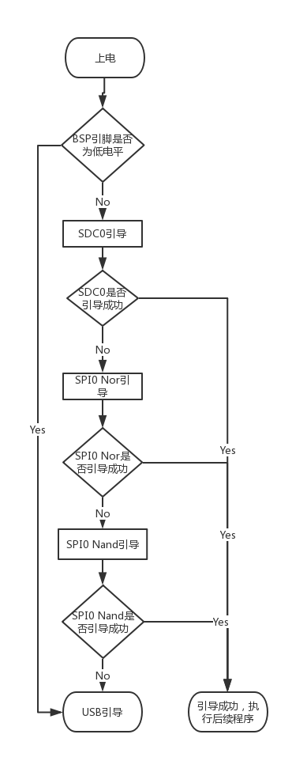
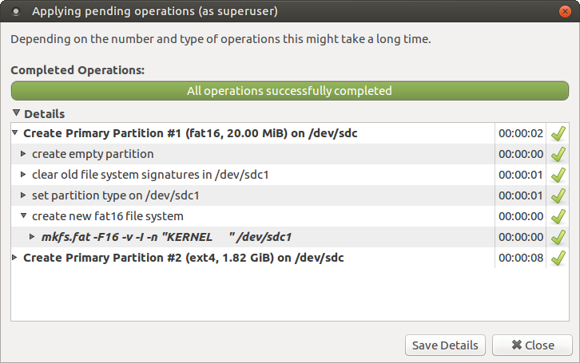
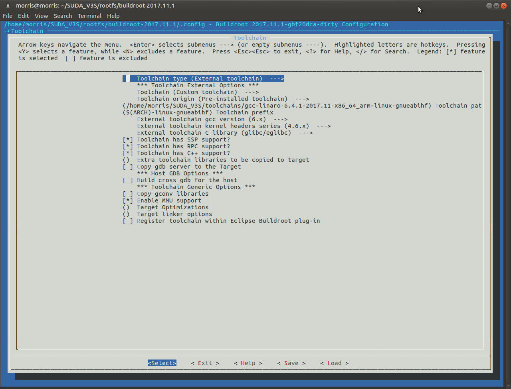

# SUDA-V3S User Guide

### 简介

1. 主控芯片
   * 全志V3S处理器，单核Cortex-A7，工作主频24M~1.2GHz，内置64MB DDR2
   * 支持从SD卡启动，支持从SPI Flash启动(8~32MB Nor Flash或者128MB Nand Flash)
   * 支持RGB LCD，分辨率可以为272x480，480x800，1024x600
   * 40nm工艺
2. 功耗
   * 1GHz，Linux空闲状态，90~100mA
   * 1GHz，Linux全速运行，180mA

### sunxi

> * 全志(Allwinner)公司的很多SoC产品代号都是sunxi，比如A10(sun4i)，A13(sun5i)，A20(sun7i)，[详细信息可以查看全志SoC家族产品](https://sunxi.org/Allwinner_SoC_Family)，我们将要使用的V3s属于sun8i.
> * sunxi也是一个专门负责推广和支持全志SoC平台开源硬件的社区，但是全志本身并没有加入这个社区.

### 系统引导流程



* 其中的BSP(boot select pin)引脚为PC0，短接PC0和GND后上电即可进入USB引导模式(可以通过sunxi-tool工具来烧写程序到SPI Flash中)

### 安装交叉编译器arm-linux-gnueabihf

[下载地址](https://releases.linaro.org/components/toolchain/binaries/latest/arm-linux-gnueabihf/)

```shell
wget https://releases.linaro.org/components/toolchain/binaries/6.4-2017.11/arm-linux-gnueabihf/gcc-linaro-6.4.1-2017.11-x86_64_arm-linux-gnueabihf.tar.xz
tar xvf gcc-linaro-6.4.1-2017.11-x86_64_arm-linux-gnueabihf.tar.xz
mv gcc-linaro-6.4.1-2017.11-x86_64_arm-linux-gnueabihf /opt/
vim /etc/bash.bashrc
# add: PATH="$PATH:/opt/gcc-linaro-6.4.1-2017.11-x86_64_arm-linux-gnueabihf/bin"
arm-linux-gnueabihf-gcc -v
sudo apt-get install device-tree-compiler
```

### 下载&编译u-boot

```shell
git clone https://github.com/Lichee-Pi/u-boot.git -b v3s-current
#or git clone https://github.com/Lichee-Pi/u-boot.git -b v3s-spi-experimental
cd u-boot
make ARCH=arm CROSS_COMPILE=arm-linux-gnueabihf- LicheePi_Zero_800x480LCD_defconfig
#or make ARCH=arm CROSS_COMPILE=arm-linux-gnueabihf- LicheePi_Zero_480x272LCD_defconfig
#or make ARCH=arm CROSS_COMPILE=arm-linux-gnueabihf- LicheePi_Zero_defconfig
make ARCH=arm menuconfig
time make ARCH=arm CROSS_COMPILE=arm-linux-gnueabihf- 2>&1 | tee build.log
```

* 最终在当前目录中会增加两个文件：u-boot-sunxi-with-spl.bin和build.log

#### u-boot中的目录结果

```bash
├── api                存放uboot提供的API接口函数
├── arch               平台相关的部分我们只需要关心这个目录下的ARM文件夹
│   ├──arm
│   │   └──cpu
│   │   │   └──armv7
│   │   └──dts	
│   │   │   └──*.dts   存放设备的dts,也就是设备配置相关的引脚信息
├── board              对于不同的平台的开发板对应的代码
├── cmd                顾名思义，大部分的命令的实现都在这个文件夹下面。
├── common             公共的代码
├── configs            各个板子的对应的配置文件都在里面，我们的Lichee配置也在里面
├── disk               对磁盘的一些操作都在这个文件夹里面，例如分区等。
├── doc                参考文档，这里面有很多跟平台等相关的使用文档。
├── drivers            各式各样的驱动文件都在这里面
├── dts                一种树形结构（device tree）这个应该是uboot新的语法
├── examples           官方给出的一些样例程序
├── fs                 文件系统，uboot会用到的一些文件系统
├── include            头文件，所有的头文件都在这个文件夹下面
├── lib                一些常用的库文件在这个文件夹下面  
├── Licenses           这个其实跟编译无关了，就是一些license的声明
├── net                网络相关的，需要用的小型网络协议栈
├── post               上电自检程序
├── scripts            编译脚本和Makefile文件
├── spl                second program loader，即相当于二级uboot启动。
├── test               小型的单元测试程序。
└── tools              里面有很多uboot常用的工具
```

###编译boot.scr

#### 编写boot.cmd文件(启动参数文件)

```shell
setenv bootargs console=ttyS0,115200 panic=5 console=tty0 rootwait root=/dev/mmcblk0p2 earlyprintk rw
load mmc 0:1 0x41000000 zImage
load mmc 0:1 0x41800000 sun8i-v3s-licheepi-zero-dock.dtb
bootz 0x41000000 - 0x41800000
```

####编译成二进制文件

```ba
mkimage -C none -A arm -T script -d boot.cmd boot.scr
```

### 下载&编译Linux内核

```shell
git clone https://github.com/Lichee-Pi/linux.git
cd linux
make ARCH=arm licheepi_zero_defconfig
make ARCH=arm menuconfig   #add bluethooth, etc.
make ARCH=arm CROSS_COMPILE=arm-linux-gnueabihf- -j16
make ARCH=arm CROSS_COMPILE=arm-linux-gnueabihf- -j16 INSTALL_MOD_PATH=out modules
make ARCH=arm CROSS_COMPILE=arm-linux-gnueabihf- -j16 INSTALL_MOD_PATH=out modules_install
```

最终会在arch/arm/boot下生成zImage，在arch/arm/boot/dts/下生成设备树二进制文件，在out文件夹下生成驱动.ko文件

### 系统烧写

 #### SD卡分区

> SD卡中的系统镜像一般分为三个区，第一个区称为boot区或者引导区，该部分没有文件系统而是直接将二进制的bootloader(uboot)文件直接写入。第二个区可以被称为linux内核区，fat文件系统，存放linux内核、内核参数文件还有设备数dtb文件。第三个区是root分区，用来存放根文件系统和用户数据等，一般是ext4文件分区格式。
>
> SD卡区域划分：
>
> | 0~2MB  | +20M   | Rest   |
> | ------ | ------ | ------ |
> | u-boot | kernel | rootfs |

1. 准备一张空白的SD卡，打开GParted系统工具


2. 新建一个20MB大小的分区，并选择文件系统的格式fat16


3. 讲SD卡剩余空间新建为一个新的分区，并选择文件系统的格式为ext4


4. 最终SD的分区结果如下图所示，单击:heavy_check_mark:开始执行分区操作





5. 打开终端，输入命令`sudo fdisk -l /dev/sdc`查看分区信息，其中sdc1代表sdc设备的第一个分区，sdc2代表第二个分区


#### 烧写u-boot

> u-boot需要烧写到SD卡的8K偏移处
>
> `sudo dd if=u-boot-sunxi-with-spl.bin of=/dev/sdc bs=1024 seek=8`


Linux主机安装minicom，使用命令：`sudo apt-get install minicom`

串口终端tty属于**dialout**组别，需要将当前用户添加到该组中，这样才有权限访问tty*设备，具体使用如下命令:`sudo usermod -a -G dialout your-user-name`

#### 烧写内核启动参数,zImage和设备树

1. 编写boot.cmd文件，并且编译成boot.scr二进制
2. 将boot.scr，zImage，dtb设备文件拷贝到SD卡的第一个分区


### 根文件系统之buildroot

> buildroot可用于构建小型的linux根文件系统，大小最小可低至2M
>
> buildroot中可以方便地加入第三方软件包，省去了手工交叉编译的烦恼
>
> 美中不足的是不支持包管理系统

```bash
git clone https://git.busybox.net/buildroot
cd buildroot
make menuconfig
make
```

编译结束后，会在output/images下生成归档文件``rootfs.tar``，使用超级权限将其解压至SD卡的第二分区中

`sudo tar -vxf rootfs.tar -C /media/morris/rootfs/`

* 如果需要在buildroot的基础上做进一步的修改，直接进入``output/target/``目录下，在这里修改一些文件，然后重新在根目录下执行``make``，会将跟新的文件内容重新打包到新的rootfs.tar中

  * 注意output/target目录不是最终的根文件系统，是临时的，不能直接拿来烧录

* 举个例子：修改环境变量**PS1**(默认提示符)

  ```bash
  cd output/target
  vim etc/profile
  #增加export PS1='\[\e[32m\][\[\e[35m\]\u\[\e[m\]@\[\e[36m\]\h \[\e[31m\]\w\[\e[32m\]]\[\e[36m\]$\[\e[m\]'
  cd ../../
  make
  ```

* buildroot的一些重要配置

  1. 配置工具链，使用本地已经安装好的交叉编译工具链，在本机上外部工具链配置为：/home/morris/SUDA_V3S/toolchains/gcc-linaro-6.4.1-2017.11-x86_64_arm-linux-gnueabihf
  2. 工具链前缀是：arm-linux-gnueabihf
  3. 外部工具链gcc版本：这里使用的是6.4版本
  4. 外部工具链内核头文件：是在arm-linux-gnueabi/libc/usr/include/linux/version.h里读取内核版本信息。这里的版本是4.6
  5. C库还是选择传统的glibc。需要小体积可以选uclibc（需要自行编译安装）
  6. 在system 设置下主机名，root密码等




### 根文件系统之Multistrap

### 可能需要使用的shell脚本

#### 清除SD卡中的所有分区

```bash
#!/bin/bash
sudo fdisk $1 <<EOF
d
1
d
2
d
3
d
4
w
p
q
EOF
sync
```

#### 创建分区

```bash
#!/bin/bash
sudo fdisk $1 <<EOF
n
p
1

+8M

n
p
2


p
w
q
EOF
```

#### 格式化分区

```bash
#!/bin/bash
sudo mkfs.vfat "$1"1 &&\
sudo mkfs.ext4 "$1"2 
```

#### 烧写uboot

```bash
#!/bin/bash
sudo dd if=/dev/zero of=$1 bs=1024 seek=8 count=512 &&\
sudo dd if=u-boot-sunxi-with-spl.bin of=$1 bs=1024 seek=8 &&\
sync
```

#### 烧写zImage

```bash
#!/bin/bash
sudo mount "$1"1 mnt &&\
sudo cp zImage mnt/ &&\
sudo cp sun8i-v3s-licheepi-zero*.dtb mnt/ &&\
sudo cp boot.scr mnt/ &&\
sync &&\
sudo umount "$1"1 &&\
echo "###write partion 1 ok!"
sudo umount mnt >/dev/null 2>&1
echo ""
```

#### 烧写rootfs

```bash
#!/bin/bash
sudo mount "$1"2 mnt &&\
#sudo cp -R game/* mnt/usr/games/
#sudo chmod 777 -R mnt/usr/games
sudo rm -rf mnt/* &&\
sudo tar xzvf rootfs-$2\.tar.gz -C mnt/ &&\
sudo umount "$1"2 &&\
./write_overlay.sh $1 $2 &&\
./write_swap.sh $1 &&\
sync &&\
echo "###write partion 2 ok!"
sudo umount mnt >/dev/null 2>&1
```

#### 创建交换分区

```bash
#!/bin/sh
sudo mount "$1"2 mnt &&\
sudo dd if=/dev/zero of=mnt/swap bs=1M count=128 &&\
sudo mkswap mnt/swap &&\
echo "/swap swap swap defaults 0 0" >> mnt/etc/fstab &&\
sudo umount "$1"2 &&\
sync &&\
echo "###write swap ok!"
sudo umount mnt >/dev/null 2>&1
```


### 设备树简介

> Device Tree是一种描述硬件的数据结构。通过将dts(device tree source)文件编译成dtb二进制文件，供Linux操作系统内核识别目标板卡上的硬件信息。
>
> 在系统起来之后，可以在**/sys/firmware/devicetree**中查看实际使用的设备树。

```bash
/ {  
    node1 {  
        a-string-property = "A string";  
        a-string-list-property = "first string", "second string";  
        a-byte-data-property = [0x01 0x23 0x34 0x56];  
        child-node1 {  
            first-child-property;  
            second-child-property = <1>;  
            a-string-property = "Hello, world";  
        };  
        child-node2 {  
        };  
    };  
    node2 {  
        an-empty-property;  
        a-cell-property = <1 2 3 4>; /* each number (cell) is a uint32 */  
        child-node1 {  
        };  
    };  
};
```

* deviec tree由节点和属性组成，节点下面可以包含子节点，属性通过键值对来描述。

####设备树与驱动的配合

1. 驱动代码

```c
static struct of_device_id beep_table[] = {  
    {.compatible = "fs4412,beep"},  
};  
static struct platform_driver beep_driver=  
{  
    .probe = beep_probe,  
    .remove = beep_remove,  
    .driver={  
        .name = "bigbang",  
        .of_match_table = beep_table,  
    },  
};
```

2. 设备树描述

```c
fs4412-beep{  
         compatible = "fs4412,beep";  
         reg = <0x114000a0 0x4 0x139D0000 0x14>;  
};  
```

* **compatible**，关键属性，驱动中使用of_match_table，即of_device_id列表，其中就使用compatible字段来匹配设备。简单地说就是，内核启动后会把设备树加载到树状结构体中，当insmod的时候，就会在树中查找匹配的设备节点来加载
* **reg**，描述寄存器基址和长度，可以有多个


### u-boot开机logo替换

### 制作刷机包


#### 参考文档

[荔枝派Zero指南 · 看云](https://www.kancloud.cn/lichee/lpi0)


